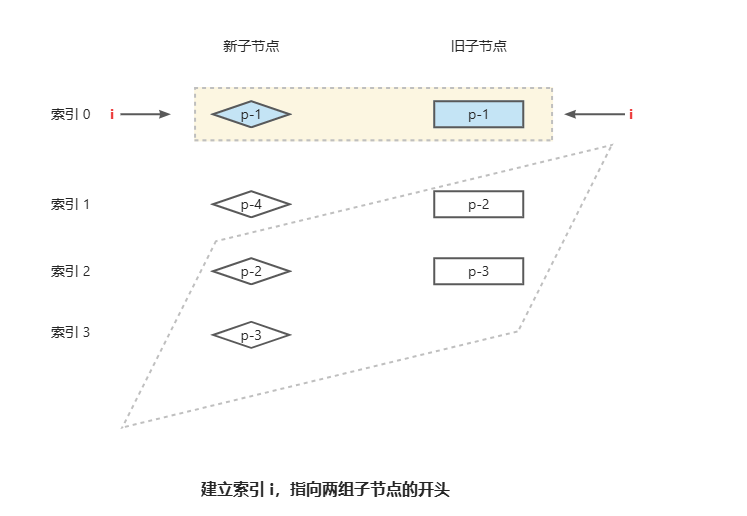
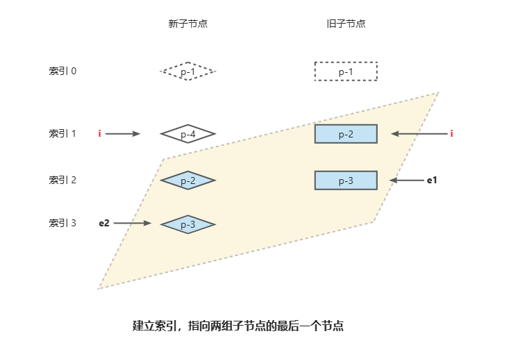
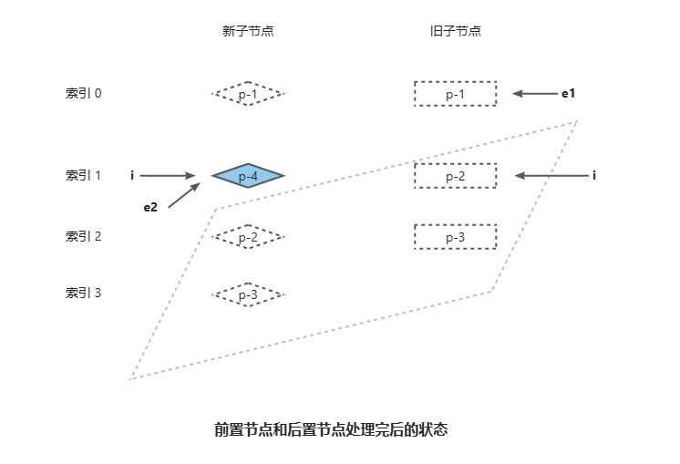
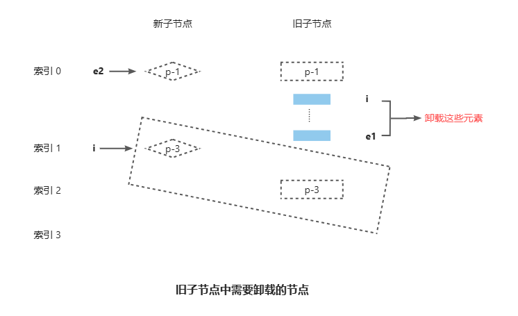
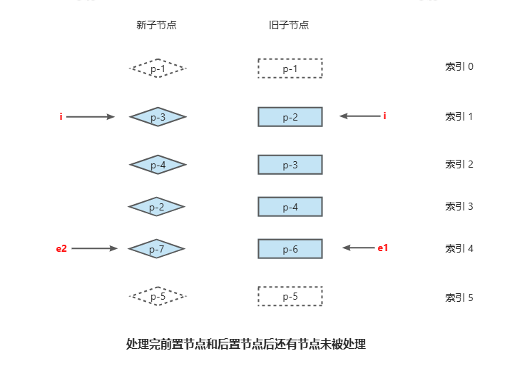
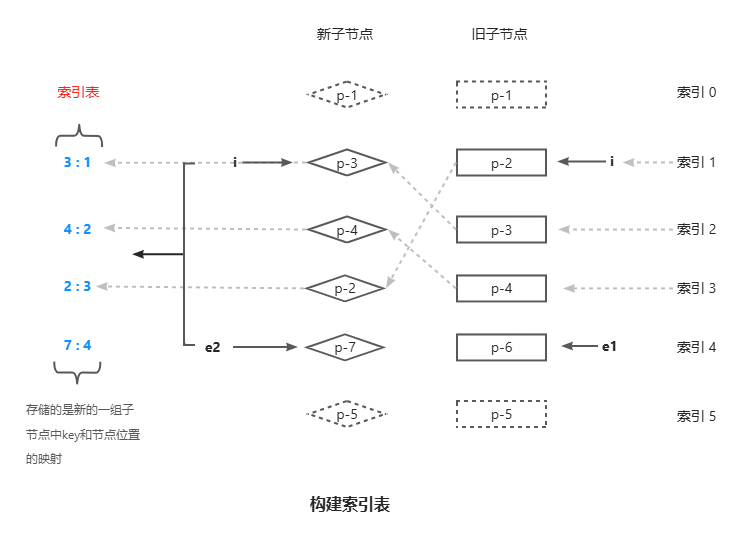
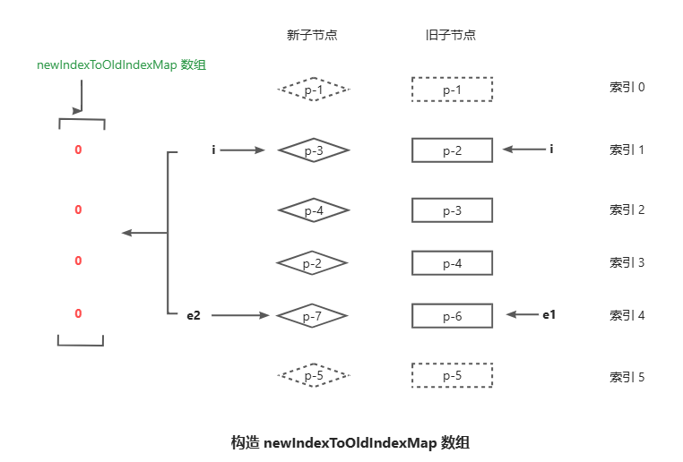
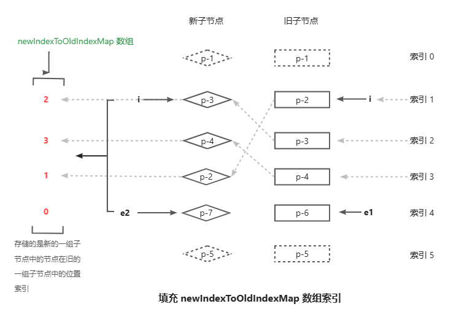

快速 Diff 算法在实测中性能最优。它借鉴了文本 Diff 中的预处理思路，先处理新旧两组子节点中相同的前置节点和相同的后置节点。当前置节点和后置节点全部处理完毕后，如果无法简单地通过挂载新节点或者卸载已经不存在的节点来完成更新，则需要根据节点的索引关系，构造出一个最长递增子序列。最长递增子序列所指向的节点即为不需要移动的节点。

# [最长递增子序列](https://leetcode.cn/problems/longest-increasing-subsequence/solutions/147667/zui-chang-shang-sheng-zi-xu-lie-by-leetcode-soluti/)

给你一个整数数组 nums ，找到其中最长严格递增子序列的长度。

子序列 是由数组派生而来的序列，删除（或不删除）数组中的元素而不改变其余元素的顺序。例如，[3,6,2,7] 是数组 [0,3,1,6,2,2,7] 的子序列。

```md
输入：nums = [10,9,2,5,3,7,101,18]
输出：4
解释：最长递增子序列是 [2,3,7,101]，因此长度为 4 
```

动态规划

```ts
function lengthOfLIS(nums: number[]): number {
    if (nums.length === 0) {
        return 0;
    }
    let dp: number[] = new Array(nums.length);
    dp[0] = 1;
    let maxans = 1;
    for (let i = 1; i < nums.length; i++) {
        // dp[i]: 以i结尾的最长递增子系列
        dp[i] = 1;
        // 遍历i之前的元素，找到可以添加到以i结尾子系列中
        for (let j = 0; j < i; j++) {
            if (nums[i] > nums[j]) {
                dp[i] = Math.max(dp[i], dp[j] + 1);
            }
        }
        maxans = Math.max(maxans, dp[i]);
    }
    return maxans;
}
```
贪心 + 二分查找

```ts
function lengthOfLIS(nums: number[]): number {
    let len: number = 1, n: number = nums.length;
    if (n === 0) {
        return 0;
    }
    let d: number[] = new Array(n + 1);
    // 贪心
    // 获取第一个数组的值
    // 循环遍历获取比它大的值加入数组队列
    // 组成递增子序列
    d[len] = nums[0];
    for (let i = 1; i < n; ++i) {
        // 获取
        if (nums[i] > d[len]) {
            d[++len] = nums[i];
        } else {
          // 二分查找
          // 如果当前值nums[i]不大于上一值
          // 则通过二分查找找出d[]里第一个大于nums[i]的位置，并用nums[i]替换掉原来的值
          // 为了得到一种“增益”，使得当前最长增长子序列序列增长的更慢一点 末尾值要越小

          // 如果找不到说明所有的数都比 nums[i] 大，此时要更新 d[1]，所以这里将 pos 设为 0
            let l: number = 1, r: number = len, pos: number = 0;
            while (l <= r) {
              // 计算两个数 l 和 r 的中间值
              //  d[]是递增数组
                let mid: number = (l + r) >> 1;
                if (d[mid] < nums[i]) {
                    pos = mid;
                    l = mid + 1;
                } else {
                    r = mid - 1;
                }
            }
            d[pos + 1] = nums[i];
        }
    }
    return len;
}

```
# Vue3 最长递增子序列

- 循环遍历原数组，判断原数组元素是否大于新数组最后一个元素，大加入到新数组最后
- 如果遍历中的元素小于新数组的最后一位，则通过二分查找找到新数组中第一个大于该元素的位置，并替换掉该位置的元素
- 如果新数组没有大于该遍历元素的元素，则替换第一位元素
```ts
// https://en.wikipedia.org/wiki/Longest_increasing_subsequence
function getSequence(arr: number[]): number[] {
  // 拷贝一个数组 p，p[i]记录的是result在arr[i]更新前记录的上一个值,保存当前项对应的前一项的索引
  const p = arr.slice()
  // result记录的是最长递增子序列的 索引
  const result = [0]
  let i, j, u, v, c
  const len = arr.length
  for (i = 0; i < len; i++) {
    const arrI = arr[i]
    if (arrI !== 0) {
      j = result[result.length - 1]
      // // (1) arrI 比 arr[j]大（当前值大于上次最长子系列的末尾值），直接添加
      if (arr[j] < arrI) {
        p[i] = j
        result.push(i)
        // （最小末尾值：要想得到最长递增子系列，需要子系列增长越慢越好，所以子系列末尾值需要最小）
        continue
      }
     // (2) arrI <= arr[j] 通过二分查找，找到后替换它；u和v相等时循环停止
      u = 0
      v = result.length - 1

      while (u < v) {
        // 获取中间值 u+v/2
        c = (u + v) >> 1
        if (arr[result[c]] < arrI) {
          u = c + 1
        } else {
          v = c
        }
      }
      // 比较 => 替换, 当前子系列从头找到第一个大于当前值arrI，并替换
      if (arrI < arr[result[u]]) {
        if (u > 0) {
          // 有可能替换会导致结果不正确，需要一个新数组 p 记录正确的结果
          p[i] = result[u - 1]
        }
        result[u] = i
      }
    }
  }
  // 没有回溯
  // 2, 1, 5, 3, 6, 4, 8, 9, 7 =》 [1, 3, 4, 8, 9]
  
  //i
  //1步 2
  //2步 1
  //3步 1 5 p[2] =1 result:[1,2]
  //4步 1 3 p[3] =1 result:[1,3] 更新index为3这个位置的元素的时候，前一个比他小的元素index是1
  //5步 1 3 6 p[4] =3 result:[1,3,4]
  //6步 1 3 4 p[5] =3 result:[1,3,5] 更新index为5这个位置的元素的时候，前一个比他小的元素index是3
  //7步 1 3 4 8 p[6] =5 result:[1,3,5,6] 更新index为6这个位置的元素的时候，前一个比他小的元素index是5
  //8步 1 3 4 8 9 p[7] =6 result:[1,3,5,6,7] 更新index为7这个位置的元素的时候，前一个比他小的元素index是6
  //9步 1 3 4 7 9 p[8] =5 result:[1,3,5,8,7]

  // 操作结束后，result中的最后一个元素一定是最大子序列的最后一个元素，
  // 但是前面的值不一定正确，比如第9步的时候7将8替换掉了，已经不满足子序列的条件了
  // 所以需要数组p来记录 数组p中记录了第i次操作的时候，这次将要替换的元素的前一个元素（比它小的那个元素） 的index


  // 回溯

  // 最后进行一个回溯的操作
  // 从result的最后一个元素开始，result中最后一个元素7肯定对应着最大子序列的最后一个，
  // 去p数组中找，p数组中对应的这个元素，记录了更新index为7的时候的前一个比他小的元素的index
  // 向前回溯去找
  u = result.length
  v = result[u - 1]
  while (u-- > 0) {
    result[u] = v
    v = p[v]
  }
  return result
}

```


# patchKeyedChildren

::: details `patchKeyedChildren`

```ts
  // can be all-keyed or mixed
  const patchKeyedChildren = (
    c1: VNode[],
    c2: VNodeArrayChildren,
    container: RendererElement,
    parentAnchor: RendererNode | null,
    parentComponent: ComponentInternalInstance | null,
    parentSuspense: SuspenseBoundary | null,
    namespace: ElementNamespace,
    slotScopeIds: string[] | null,
    optimized: boolean,
  ) => {
    let i = 0
    const l2 = c2.length
    let e1 = c1.length - 1 // prev ending index
    let e2 = l2 - 1 // next ending index

    // 1. sync from start
    // (a b) c
    // (a b) d e
    while (i <= e1 && i <= e2) {
      const n1 = c1[i]
      const n2 = (c2[i] = optimized
        ? cloneIfMounted(c2[i] as VNode)
        : normalizeVNode(c2[i]))
      if (isSameVNodeType(n1, n2)) {
        patch(
          n1,
          n2,
          container,
          null,
          parentComponent,
          parentSuspense,
          namespace,
          slotScopeIds,
          optimized,
        )
      } else {
        break
      }
      i++
    }

    // 2. sync from end
    // a (b c)
    // d e (b c)
    while (i <= e1 && i <= e2) {
      const n1 = c1[e1]
      const n2 = (c2[e2] = optimized
        ? cloneIfMounted(c2[e2] as VNode)
        : normalizeVNode(c2[e2]))
      if (isSameVNodeType(n1, n2)) {
        patch(
          n1,
          n2,
          container,
          null,
          parentComponent,
          parentSuspense,
          namespace,
          slotScopeIds,
          optimized,
        )
      } else {
        break
      }
      e1--
      e2--
    }

    // 3. common sequence + mount
    // (a b)
    // (a b) c
    // i = 2, e1 = 1, e2 = 2
    // (a b)
    // c (a b)
    // i = 0, e1 = -1, e2 = 0
    if (i > e1) {
      if (i <= e2) {
        const nextPos = e2 + 1
        const anchor = nextPos < l2 ? (c2[nextPos] as VNode).el : parentAnchor
        while (i <= e2) {
          patch(
            null,
            (c2[i] = optimized
              ? cloneIfMounted(c2[i] as VNode)
              : normalizeVNode(c2[i])),
            container,
            anchor,
            parentComponent,
            parentSuspense,
            namespace,
            slotScopeIds,
            optimized,
          )
          i++
        }
      }
    }

    // 4. common sequence + unmount
    // (a b) c
    // (a b)
    // i = 2, e1 = 2, e2 = 1
    // a (b c)
    // (b c)
    // i = 0, e1 = 0, e2 = -1
    else if (i > e2) {
      while (i <= e1) {
        unmount(c1[i], parentComponent, parentSuspense, true)
        i++
      }
    }

    // 5. unknown sequence
    // [i ... e1 + 1]: a b [c d e] f g
    // [i ... e2 + 1]: a b [e d c h] f g
    // i = 2, e1 = 4, e2 = 5
    else {
      const s1 = i // prev starting index
      const s2 = i // next starting index

      // 5.1 build key:index map for newChildren
      const keyToNewIndexMap: Map<PropertyKey, number> = new Map()
      for (i = s2; i <= e2; i++) {
        const nextChild = (c2[i] = optimized
          ? cloneIfMounted(c2[i] as VNode)
          : normalizeVNode(c2[i]))
        if (nextChild.key != null) {
          if (__DEV__ && keyToNewIndexMap.has(nextChild.key)) {
            warn(
              `Duplicate keys found during update:`,
              JSON.stringify(nextChild.key),
              `Make sure keys are unique.`,
            )
          }
          keyToNewIndexMap.set(nextChild.key, i)
        }
      }

      // 5.2 loop through old children left to be patched and try to patch
      // matching nodes & remove nodes that are no longer present
      let j
      let patched = 0
      const toBePatched = e2 - s2 + 1
      let moved = false
      // used to track whether any node has moved
      let maxNewIndexSoFar = 0
      // works as Map<newIndex, oldIndex>
      // Note that oldIndex is offset by +1
      // and oldIndex = 0 is a special value indicating the new node has
      // no corresponding old node.
      // used for determining longest stable subsequence
      const newIndexToOldIndexMap = new Array(toBePatched)
      for (i = 0; i < toBePatched; i++) newIndexToOldIndexMap[i] = 0

      for (i = s1; i <= e1; i++) {
        const prevChild = c1[i]
        if (patched >= toBePatched) {
          // all new children have been patched so this can only be a removal
          unmount(prevChild, parentComponent, parentSuspense, true)
          continue
        }
        let newIndex
        if (prevChild.key != null) {
          newIndex = keyToNewIndexMap.get(prevChild.key)
        } else {
          // key-less node, try to locate a key-less node of the same type
          for (j = s2; j <= e2; j++) {
            if (
              newIndexToOldIndexMap[j - s2] === 0 &&
              isSameVNodeType(prevChild, c2[j] as VNode)
            ) {
              newIndex = j
              break
            }
          }
        }
        if (newIndex === undefined) {
          unmount(prevChild, parentComponent, parentSuspense, true)
        } else {
          newIndexToOldIndexMap[newIndex - s2] = i + 1
          if (newIndex >= maxNewIndexSoFar) {
            maxNewIndexSoFar = newIndex
          } else {
            moved = true
          }
          patch(
            prevChild,
            c2[newIndex] as VNode,
            container,
            null,
            parentComponent,
            parentSuspense,
            namespace,
            slotScopeIds,
            optimized,
          )
          patched++
        }
      }

      // 5.3 move and mount
      // generate longest stable subsequence only when nodes have moved
      const increasingNewIndexSequence = moved
        ? getSequence(newIndexToOldIndexMap)
        : EMPTY_ARR
      j = increasingNewIndexSequence.length - 1
      // looping backwards so that we can use last patched node as anchor
      for (i = toBePatched - 1; i >= 0; i--) {
        const nextIndex = s2 + i
        const nextChild = c2[nextIndex] as VNode
        const anchor =
          nextIndex + 1 < l2 ? (c2[nextIndex + 1] as VNode).el : parentAnchor
        if (newIndexToOldIndexMap[i] === 0) {
          // mount new
          patch(
            null,
            nextChild,
            container,
            anchor,
            parentComponent,
            parentSuspense,
            namespace,
            slotScopeIds,
            optimized,
          )
        } else if (moved) {
          // move if:
          // There is no stable subsequence (e.g. a reverse)
          // OR current node is not among the stable sequence
          if (j < 0 || i !== increasingNewIndexSequence[j]) {
            move(nextChild, container, anchor, MoveType.REORDER)
          } else {
            j--
          }
        }
      }
    }
  }
  ```
:::

## 处理前置节点



```ts
let i = 0
// 新的一组子节点的长度
const l2 = c2.length
// 旧的一组子节点最后一个节点的索引位置
let e1 = c1.length - 1 // prev ending index
// 新的一组子节点的最后一个节点的索引位置
let e2 = l2 - 1 // next ending index
    // 1. sync from start
    // (a b) c
    // (a b) d e
    while (i <= e1 && i <= e2) {
      const n1 = c1[i]
      const n2 = (c2[i] = optimized
        ? cloneIfMounted(c2[i] as VNode)
        : normalizeVNode(c2[i]))
      if (isSameVNodeType(n1, n2)) {
        patch(
          n1,
          n2,
          container,
          null,
          parentComponent,
          parentSuspense,
          namespace,
          slotScopeIds,
          optimized,
        )
      } else {
        break
      }
      i++
    }
```

## 处理后置节点



```ts
    // 2. sync from end
    // a (b c)
    // d e (b c)
    while (i <= e1 && i <= e2) {
      const n1 = c1[e1]
      const n2 = (c2[e2] = optimized
        ? cloneIfMounted(c2[e2] as VNode)
        : normalizeVNode(c2[e2]))
      if (isSameVNodeType(n1, n2)) {
        patch(
          n1,
          n2,
          container,
          null,
          parentComponent,
          parentSuspense,
          namespace,
          slotScopeIds,
          optimized,
        )
      } else {
        break
      }
      e1--
      e2--
    }

```


## 新增节点

前置节点和后置节点处理完毕后，新旧两组子节点的状态如下图所示




- 条件一：e1 <  i 成立：说明在预处理过程中，所有旧子节点都处理完毕了。
- 条件二：e2 >= i 成立：说明在预处理过后，在新的一组子节点中，仍然有未被处理的节点，这些遗留的节点将被视作新增节点。

```ts
    // 3. common sequence + mount
    // (a b)
    // (a b) c
    // i = 2, e1 = 1, e2 = 2
    // (a b)
    // c (a b)
    // i = 0, e1 = -1, e2 = 0
    if (i > e1) {
      if (i <= e2) {
        const nextPos = e2 + 1
        const anchor = nextPos < l2 ? (c2[nextPos] as VNode).el : parentAnchor
        while (i <= e2) {
          patch(
            null,
            (c2[i] = optimized
              ? cloneIfMounted(c2[i] as VNode)
              : normalizeVNode(c2[i])),
            container,
            anchor,
            parentComponent,
            parentSuspense,
            namespace,
            slotScopeIds,
            optimized,
          )
          i++
        }
      }
    }
```
## 删除节点
当相同的前置节点和后置节点全部处理完毕后，新的一组子节点已经全部处理完毕了，而旧的一组子节点中还有遗留的节点未被处理，这些节点都是需要卸载的。



```ts
    // 4. common sequence + unmount
    // (a b) c
    // (a b)
    // i = 2, e1 = 2, e2 = 1
    // a (b c)
    // (b c)
    // i = 0, e1 = 0, e2 = -1
    else if (i > e2) {
      while (i <= e1) {
        unmount(c1[i], parentComponent, parentSuspense, true)
        i++
      }
    }

```
## 非理想情况下的未被处理节点
在非理想情况下，经过预处理后，无论是新的一组子节点，还是旧的一组节点，都有部分节点未经处理。



要对非理想情况下未被处理的节点进行处理，就需要先找出那些需要移动的节点。


### 构建索引表

为新的一组子节点构建一张索引表，用来存储新的一组子节点的 key 和节点位置索引之间的映射，其目的是为了可以快速找到新的一组子节点中节点所在的位置，解决潜在的性能问题。



```ts
      const s1 = i // prev starting index
      const s2 = i // next starting index

      // 5.1 build key:index map for newChildren
      // map 集合的键是节点的 key
      // map 集合的值是节点的索引位置
      const keyToNewIndexMap: Map<PropertyKey, number> = new Map()
      for (i = s2; i <= e2; i++) {
        const nextChild = (c2[i] = optimized
          ? cloneIfMounted(c2[i] as VNode)
          : normalizeVNode(c2[i]))
        if (nextChild.key != null) {
          if (__DEV__ && keyToNewIndexMap.has(nextChild.key)) {
            warn(
              `Duplicate keys found during update:`,
              JSON.stringify(nextChild.key),
              `Make sure keys are unique.`,
            )
          }
          keyToNewIndexMap.set(nextChild.key, i)
        }
      }

```

### 构造 newIndexToOldIndexMap 数组

newIndexToOldIndexMap 数组用来存储新的一组子节点中的节点在旧的一组子节点中的位置索引，后面将会使用它计算出一个最长递增子序列，并用于辅助完成 DOM 移动的操作。





```ts
      // 5.2 loop through old children left to be patched and try to patch
      // matching nodes & remove nodes that are no longer present
      let j
      let patched = 0
      const toBePatched = e2 - s2 + 1
      let moved = false
      // used to track whether any node has moved
      let maxNewIndexSoFar = 0
      // works as Map<newIndex, oldIndex>
      // Note that oldIndex is offset by +1
      // and oldIndex = 0 is a special value indicating the new node has
      // no corresponding old node.
      // used for determining longest stable subsequence
      const newIndexToOldIndexMap = new Array(toBePatched)
      for (i = 0; i < toBePatched; i++) newIndexToOldIndexMap[i] = 0
      // 遍历旧节点
      for (i = s1; i <= e1; i++) {
        // 旧数组中剩余未处理的节点
        const prevChild = c1[i]
        // 如果更新过的节点数量大于需要更新的节点数量，则卸载多余的节点
        if (patched >= toBePatched) {
          // all new children have been patched so this can only be a removal
          unmount(prevChild, parentComponent, parentSuspense, true)
          continue
        }
        let newIndex
        if (prevChild.key != null) {
          // 获取旧节点在新节点中的位置
          newIndex = keyToNewIndexMap.get(prevChild.key)
        } else {
          // key-less node, try to locate a key-less node of the same type
          // s2新节点数组起始位置
          for (j = s2; j <= e2; j++) {
            if (
              newIndexToOldIndexMap[j - s2] === 0 &&
              isSameVNodeType(prevChild, c2[j] as VNode)
            ) {
              newIndex = j
              break
            }
          }
        }
        // 新节点没有卸载
        if (newIndex === undefined) {
          unmount(prevChild, parentComponent, parentSuspense, true)
        } else {
         // s2新节点数组起始位置
          newIndexToOldIndexMap[newIndex - s2] = i + 1
          // 通过比较 newIndex 和 maxNewIndexSoFar 的值来判断节点是否需要移动
          // 如果在遍历过程中遇到的索引值呈现递增趋势，则说明不需要移动节点
          if (newIndex >= maxNewIndexSoFar) {
            maxNewIndexSoFar = newIndex
          } else {
           // 否则需要移动
            moved = true
          }
          patch(
            prevChild,
            c2[newIndex] as VNode,
            container,
            null,
            parentComponent,
            parentSuspense,
            namespace,
            slotScopeIds,
            optimized,
          )
          patched++
        }
      }

```

### 移动节点

```ts

  // 5.3 move and mount
  // generate longest stable subsequence only when nodes have moved
  // 移动 计算最长递增子序列的索引
  const increasingNewIndexSequence = moved
    ? getSequence(newIndexToOldIndexMap)
    : EMPTY_ARR
  j = increasingNewIndexSequence.length - 1
  // looping backwards so that we can use last patched node as anchor
  // 新的一组子节点中剩余未处理节点的数量
  for (i = toBePatched - 1; i >= 0; i--) {
    const nextIndex = s2 + i
    const nextChild = c2[nextIndex] as VNode
    const anchor =
      nextIndex + 1 < l2 ? (c2[nextIndex + 1] as VNode).el : parentAnchor
    if (newIndexToOldIndexMap[i] === 0) {
      // mount new
      patch(
        null,
        nextChild,
        container,
        anchor,
        parentComponent,
        parentSuspense,
        namespace,
        slotScopeIds,
        optimized,
      )
    } else if (moved) {
      // move if:
      // There is no stable subsequence (e.g. a reverse)
      // OR current node is not among the stable sequence
      //  i 新节点索引
      //  j 子序列索引
      //  不相等 节点需要移动
      if (j < 0 || i !== increasingNewIndexSequence[j]) {
        move(nextChild, container, anchor, MoveType.REORDER)
      } else {
        j--
      }
    }
  }
```

# 参考

- 《Vue设计与实现》
