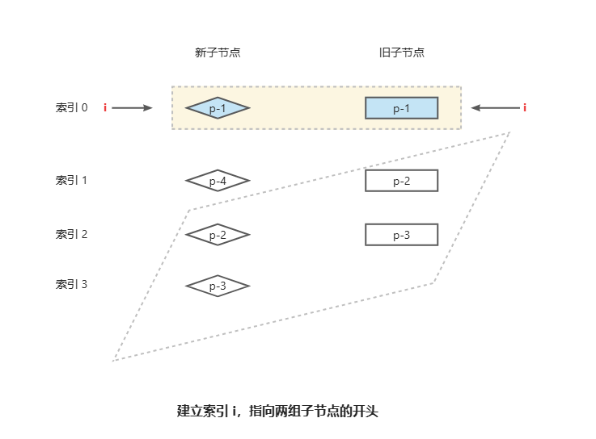

组件挂载=>`mountComponent` => `setupRenderEffect`

```ts
const setupRenderEffect = () => {
  const componentUpdateFn = () => {
    // ...
    patch()
  }
  const effect = (instance.effect = new ReactiveEffect(componentUpdateFn))
  // ...
}

```
组件更新 => `trigger` => `effect.trigger`
```ts
class ReactiveEffect {
  trigger(){
    // 就是运行this.run
    if (this.flags & EffectFlags.PAUSED) {
      pausedQueueEffects.add(this)
    } else if (this.scheduler) {
      this.scheduler()
    } else {
      this.runIfDirty()
    }
  }
  run(){
    // 传入的componentUpdateFn方法 => patch
    this.fn()
  }
}
```

# patchFlag

```ts
export enum PatchFlags {
  // TEXT：表示元素具有动态的 textContent。
  // <div>{{ dynamicText }}</div>
  TEXT = 1,
  // CLASS：表示元素具有动态的 class。
  // <div :class="dynamicClass"></div>
  CLASS = 1 << 1,
  // STYLE：表示元素具有动态的 style。
  // <div :style="{ color: dynamicColor }"></div>
  STYLE = 1 << 2,
  // PROPS：表示元素具有动态的 props。
  // <div :id="dynamicId"></div>
  PROPS = 1 << 3,
  // FULL_PROPS：表示元素具有动态的 props，并且需要完整的 diff。
  FULL_PROPS = 1 << 4,
  // HYDRATION：表示元素需要进行 hydration。
  // <div v-html="dynamicHtml"></div>
  NEED_HYDRATION = 1 << 5,
  // STABLE_FRAGMENT：表示元素是一个稳定的 fragment。
  // <template v-for="item in items"></template>
  STABLE_FRAGMENT = 1 << 6,
  // KEYED_FRAGMENT：表示元素是一个带 key 的 fragment。
  // <template v-for="item in items" :key="item.id"></template>
  KEYED_FRAGMENT = 1 << 7,
  // UNKEYED_FRAGMENT：表示元素是一个不带 key 的 fragment。
  // <template v-for="item in items"></template>
  UNKEYED_FRAGMENT = 1 << 8,
  // NEED_PATCH：表示元素需要进行 patch。，通常对应ref、指令等使用场景。
  NEED_PATCH = 1 << 9,
  // DYNAMIC_SLOTS：表示元素具有动态的 slots。
  // <component :is="dynamicComponent" v-slot:default="slotProps"></component>
  DYNAMIC_SLOTS = 1 << 10,
  // DEV_ROOT_FRAGMENT：表示用户在template的顶层写了注释而创建的flag。
  DEV_ROOT_FRAGMENT = 1 << 11,
  // HOISTED：表示提升的静态虚拟节点。patch过程可以跳过整个子树，因为静态内容永远不需要更新。
  HOISTED = -1,
  // 表示diff算法应退出优化模式，通常是对应用户使用h函数自定义渲染函数的情况。
  BAIL = -2,
}
```

# patch

```ts
const patch: PatchFn = (
  n1,
  n2,
  container,
  anchor = null,
  parentComponent = null,
  parentSuspense = null,
  namespace = undefined,
  slotScopeIds = null,
  optimized = __DEV__ && isHmrUpdating ? false : !!n2.dynamicChildren,
) => {
  if (n1 === n2) {
    return
  }
  // patching & not same type, unmount old tree
  if (n1 && !isSameVNodeType(n1, n2)) {
    anchor = getNextHostNode(n1)
    unmount(n1, parentComponent, parentSuspense, true)
    n1 = null
  }
  if (n2.patchFlag === PatchFlags.BAIL) {
    optimized = false
    n2.dynamicChildren = null
  }
  const { type, ref, shapeFlag } = n2
  switch (type) {
    // 纯文本
    case Text:
      processText(n1, n2, container, anchor)
      break
      // 注释
    case Comment:
      processCommentNode(n1, n2, container, anchor)
      break
      // 静态
    case Static:
      if (n1 == null) {
        mountStaticNode(n2, container, anchor, namespace)
      }
      break
      // 多个根节点
    case Fragment:
      processFragment(
        n1,
        n2,
        container,
        anchor,
        parentComponent,
        parentSuspense,
        namespace,
        slotScopeIds,
        optimized,
      )
      break
    default:
      // 原生DOM
      if (shapeFlag & ShapeFlags.ELEMENT) {
        processElement(
          n1,
          n2,
          container,
          anchor,
          parentComponent,
          parentSuspense,
          namespace,
          slotScopeIds,
          optimized,
        )
        // Vue组件
      } else if (shapeFlag & ShapeFlags.COMPONENT) {
        processComponent(
          n1,
          n2,
          container,
          anchor,
          parentComponent,
          parentSuspense,
          namespace,
          slotScopeIds,
          optimized,
        )
        // teleport组件
      } else if (shapeFlag & ShapeFlags.TELEPORT) {
        ;(type as typeof TeleportImpl).process(
          n1 as TeleportVNode,
          n2 as TeleportVNode,
          container,
          anchor,
          parentComponent,
          parentSuspense,
          namespace,
          slotScopeIds,
          optimized,
          internals,
        )
        // suspense组件
      } else if (__FEATURE_SUSPENSE__ && shapeFlag & ShapeFlags.SUSPENSE) {
        ;(type as typeof SuspenseImpl).process(
          n1,
          n2,
          container,
          anchor,
          parentComponent,
          parentSuspense,
          namespace,
          slotScopeIds,
          optimized,
          internals,
        )
      } else if (__DEV__) {
        warn('Invalid VNode type:', type, `(${typeof type})`)
      }
  }
  // set ref
  if (ref != null && parentComponent) {
    setRef(ref, n1 && n1.ref, parentSuspense, n2 || n1, !n2)
  }
}


```


## processText
纯文本
```ts
  const processText: ProcessTextOrCommentFn = (n1, n2, container, anchor) => {
    if (n1 == null) {
      hostInsert(
        // hostCreateText = createText 
        // createText: text => doc.createTextNode(text),
        (n2.el = hostCreateText(n2.children as string)),
        container,
        anchor,
      )
    } else {
      // hostSetText = setText 
      // setText: textNode,text => textNode.nodeValue = text,
      const el = (n2.el = n1.el!)
      if (n2.children !== n1.children) {
        hostSetText(el, n2.children as string)
      }
    }
  }
```

## processComponent
Vue组件
```ts
  const processComponent = (
    n1: VNode | null,
    n2: VNode,
    container: RendererElement,
    anchor: RendererNode | null,
    parentComponent: ComponentInternalInstance | null,
    parentSuspense: SuspenseBoundary | null,
    namespace: ElementNamespace,
    slotScopeIds: string[] | null,
    optimized: boolean,
  ) => {
    n2.slotScopeIds = slotScopeIds
    if (n1 == null) {
      // keep alive 组件
      if (n2.shapeFlag & ShapeFlags.COMPONENT_KEPT_ALIVE) {
        ;(parentComponent!.ctx as KeepAliveContext).activate(
          n2,
          container,
          anchor,
          namespace,
          optimized,
        )
      } else {
        mountComponent(
          n2,
          container,
          anchor,
          parentComponent,
          parentSuspense,
          namespace,
          optimized,
        )
      }
    } else {
      updateComponent(n1, n2, optimized)
    }
  }
  const updateComponent = (n1: VNode, n2: VNode, optimized: boolean) => {
    const instance = (n2.component = n1.component)!
    // 根据新旧虚拟节点VNode上的属性、指令、子节点等判断是否需要更新组件
    //  optimized 参数用于设置是否开启 diff 优化
    if (shouldUpdateComponent(n1, n2, optimized)) {
      if (
        __FEATURE_SUSPENSE__ &&
        instance.asyncDep &&
        !instance.asyncResolved
      ) {
        //异步组件，预更新组件
        updateComponentPreRender(instance, n2, optimized)
        return
      } else {
        //  更新对应组件实例的 next 为新的 VNode
        instance.next = n2
        // 触发更新
        instance.update()
      }
    } else {
      // no update needed. just copy over properties
      n2.el = n1.el
      instance.vnode = n2
    }
  }

```
### instance.update

```ts
const effect = (instance.effect = new ReactiveEffect(componentUpdateFn))
instance.update = effect.run.bind(effect)

class ReactiveEffect(){
  constructor(public fn: () => T) {
  }
  run(){
    // fn = componentUpdateFn
    this.fn()
  }
}
const componentUpdateFn = () => {
  if(!instance.isMounted){
    // ...
      // return normalizeVNode(...)
      instance.subTree = renderComponentRoot(instance)
  }else {
    // ...
      toggleRecurse(instance, false)
      if (next) {
        next.el = vnode.el
        // 更新props,slots
        updateComponentPreRender(instance, next, optimized)
      } else {
        next = vnode
      }
      patch(
        prevTree,
        nextTree,
        // parent may have changed if it's in a teleport
        hostParentNode(prevTree.el!)!,
        // anchor may have changed if it's in a fragment
        getNextHostNode(prevTree),
        instance,
        parentSuspense,
        namespace,
      )
      //... 
  }

}
```

## processElement

```ts
  const processElement = (
    n1: VNode | null,
    n2: VNode,
    container: RendererElement,
    anchor: RendererNode | null,
    parentComponent: ComponentInternalInstance | null,
    parentSuspense: SuspenseBoundary | null,
    namespace: ElementNamespace,
    slotScopeIds: string[] | null,
    optimized: boolean,
  ) => {
    if (n2.type === 'svg') {
      namespace = 'svg'
    } else if (n2.type === 'math') {
      namespace = 'mathml'
    }

    if (n1 == null) {
      mountElement(
        n2,
        container,
        anchor,
        parentComponent,
        parentSuspense,
        namespace,
        slotScopeIds,
        optimized,
      )
    } else {
      patchElement(
        n1,
        n2,
        parentComponent,
        parentSuspense,
        namespace,
        slotScopeIds,
        optimized,
      )
    }
  }
  const patchElement = (
    n1: VNode,
    n2: VNode,
    parentComponent: ComponentInternalInstance | null,
    parentSuspense: SuspenseBoundary | null,
    namespace: ElementNamespace,
    slotScopeIds: string[] | null,
    optimized: boolean,
  ) => {
    const el = (n2.el = n1.el!)
    let { patchFlag, dynamicChildren, dirs } = n2
    // #1426 take the old vnode's patch flag into account since user may clone a
    // compiler-generated vnode, which de-opts to FULL_PROPS
    patchFlag |= n1.patchFlag & PatchFlags.FULL_PROPS
    const oldProps = n1.props || EMPTY_OBJ
    const newProps = n2.props || EMPTY_OBJ
    let vnodeHook: VNodeHook | undefined | null

    // disable recurse in beforeUpdate hooks
    parentComponent && toggleRecurse(parentComponent, false)
    if ((vnodeHook = newProps.onVnodeBeforeUpdate)) {
      invokeVNodeHook(vnodeHook, parentComponent, n2, n1)
    }
    if (dirs) {
      invokeDirectiveHook(n2, n1, parentComponent, 'beforeUpdate')
    }
    parentComponent && toggleRecurse(parentComponent, true)


    // #9135 innerHTML / textContent unset needs to happen before possible
    // new children mount
    if (
      (oldProps.innerHTML && newProps.innerHTML == null) ||
      (oldProps.textContent && newProps.textContent == null)
    ) {
      hostSetElementText(el, '')
    }
     // 存在动态子节点，对动态子节点执行 diff 过程
    if (dynamicChildren) {
      patchBlockChildren(
        n1.dynamicChildren!,
        dynamicChildren,
        el,
        parentComponent,
        parentSuspense,
        resolveChildrenNamespace(n2, namespace),
        slotScopeIds,
      )
    } else if (!optimized) {
      // full diff
      patchChildren(
        n1,
        n2,
        el,
        null,
        parentComponent,
        parentSuspense,
        resolveChildrenNamespace(n2, namespace),
        slotScopeIds,
        false,
      )
    }

    // 处理属性和文本更新
    if (patchFlag > 0) {

      if (patchFlag & PatchFlags.FULL_PROPS) {
        // element props contain dynamic keys, full diff needed
        patchProps(el, oldProps, newProps, parentComponent, namespace)
      } else {
        // class
        if (patchFlag & PatchFlags.CLASS) {
          if (oldProps.class !== newProps.class) {
            hostPatchProp(el, 'class', null, newProps.class, namespace)
          }
        }

        // style
        if (patchFlag & PatchFlags.STYLE) {
          hostPatchProp(el, 'style', oldProps.style, newProps.style, namespace)
        }


        if (patchFlag & PatchFlags.PROPS) {
          const propsToUpdate = n2.dynamicProps!
          for (let i = 0; i < propsToUpdate.length; i++) {
            const key = propsToUpdate[i]
            const prev = oldProps[key]
            const next = newProps[key]
            // #1471 force patch value
            if (next !== prev || key === 'value') {
              hostPatchProp(el, key, prev, next, namespace, parentComponent)
            }
          }
        }
      }

      // text
      // This flag is matched when the element has only dynamic text children.
      if (patchFlag & PatchFlags.TEXT) {
        if (n1.children !== n2.children) {
          hostSetElementText(el, n2.children as string)
        }
      }
    } else if (!optimized && dynamicChildren == null) {
      // unoptimized, full diff
      patchProps(el, oldProps, newProps, parentComponent, namespace)
    }

    if ((vnodeHook = newProps.onVnodeUpdated) || dirs) {
      queuePostRenderEffect(() => {
        vnodeHook && invokeVNodeHook(vnodeHook, parentComponent, n2, n1)
        dirs && invokeDirectiveHook(n2, n1, parentComponent, 'updated')
      }, parentSuspense)
    }
  }
```


### patchBlockChildren 

```ts
  const patchBlockChildren: PatchBlockChildrenFn = (
    oldChildren,
    newChildren,
    fallbackContainer,
    parentComponent,
    parentSuspense,
    namespace: ElementNamespace,
    slotScopeIds,
  ) => {
    for (let i = 0; i < newChildren.length; i++) {
      const oldVNode = oldChildren[i]
      const newVNode = newChildren[i]
      // Determine the container (parent element) for the patch.
      const container =
        // oldVNode may be an errored async setup() component inside Suspense
        // which will not have a mounted element
        oldVNode.el &&
        // - In the case of a Fragment, we need to provide the actual parent
        // of the Fragment itself so it can move its children.
        (oldVNode.type === Fragment ||
          // - In the case of different nodes, there is going to be a replacement
          // which also requires the correct parent container
          !isSameVNodeType(oldVNode, newVNode) ||
          // - In the case of a component, it could contain anything.
          oldVNode.shapeFlag & (ShapeFlags.COMPONENT | ShapeFlags.TELEPORT))
          ? hostParentNode(oldVNode.el)!
          : // In other cases, the parent container is not actually used so we
            // just pass the block element here to avoid a DOM parentNode call.
            fallbackContainer
      patch(
        oldVNode,
        newVNode,
        container,
        null,
        parentComponent,
        parentSuspense,
        namespace,
        slotScopeIds,
        true,
      )
    }
  }

```

## processFragment 

```ts
  const processFragment = (
    n1: VNode | null,
    n2: VNode,
    container: RendererElement,
    anchor: RendererNode | null,
    parentComponent: ComponentInternalInstance | null,
    parentSuspense: SuspenseBoundary | null,
    namespace: ElementNamespace,
    slotScopeIds: string[] | null,
    optimized: boolean,
  ) => {
    const fragmentStartAnchor = (n2.el = n1 ? n1.el : hostCreateText(''))!
    const fragmentEndAnchor = (n2.anchor = n1 ? n1.anchor : hostCreateText(''))!

    let { patchFlag, dynamicChildren, slotScopeIds: fragmentSlotScopeIds } = n2

    // check if this is a slot fragment with :slotted scope ids
    if (fragmentSlotScopeIds) {
      slotScopeIds = slotScopeIds
        ? slotScopeIds.concat(fragmentSlotScopeIds)
        : fragmentSlotScopeIds
    }

    if (n1 == null) {
      hostInsert(fragmentStartAnchor, container, anchor)
      hostInsert(fragmentEndAnchor, container, anchor)
      // a fragment can only have array children
      // since they are either generated by the compiler, or implicitly created
      // from arrays.
      mountChildren(
        // #10007
        // such fragment like `<></>` will be compiled into
        // a fragment which doesn't have a children.
        // In this case fallback to an empty array
        (n2.children || []) as VNodeArrayChildren,
        container,
        fragmentEndAnchor,
        parentComponent,
        parentSuspense,
        namespace,
        slotScopeIds,
        optimized,
      )
    } else {
      if (
        patchFlag > 0 &&
        patchFlag & PatchFlags.STABLE_FRAGMENT &&
        dynamicChildren &&
        // #2715 the previous fragment could've been a BAILed one as a result
        // of renderSlot() with no valid children
        n1.dynamicChildren
      ) {
        // a stable fragment (template root or <template v-for>) doesn't need to
        // patch children order, but it may contain dynamicChildren.
        patchBlockChildren(
          n1.dynamicChildren,
          dynamicChildren,
          container,
          parentComponent,
          parentSuspense,
          namespace,
          slotScopeIds,
        )

       if (
          // #2080 if the stable fragment has a key, it's a <template v-for> that may
          //  get moved around. Make sure all root level vnodes inherit el.
          // #2134 or if it's a component root, it may also get moved around
          // as the component is being moved.
          n2.key != null ||
          (parentComponent && n2 === parentComponent.subTree)
        ) {
          traverseStaticChildren(n1, n2, true /* shallow */)
        }
      } else {
        // keyed / unkeyed, or manual fragments.
        // for keyed & unkeyed, since they are compiler generated from v-for,
        // each child is guaranteed to be a block so the fragment will never
        // have dynamicChildren.
        patchChildren(
          n1,
          n2,
          container,
          fragmentEndAnchor,
          parentComponent,
          parentSuspense,
          namespace,
          slotScopeIds,
          optimized,
        )
      }
    }
  }

```

# patchChildren 

```ts

  const patchChildren: PatchChildrenFn = (
    n1,
    n2,
    container,
    anchor,
    parentComponent,
    parentSuspense,
    namespace: ElementNamespace,
    slotScopeIds,
    optimized = false,
  ) => {
    const c1 = n1 && n1.children
    const prevShapeFlag = n1 ? n1.shapeFlag : 0
    const c2 = n2.children

    const { patchFlag, shapeFlag } = n2
    // fast path
    if (patchFlag > 0) {
      if (patchFlag & PatchFlags.KEYED_FRAGMENT) {
        // this could be either fully-keyed or mixed (some keyed some not)
        // presence of patchFlag means children are guaranteed to be arrays
        patchKeyedChildren(
          c1 as VNode[],
          c2 as VNodeArrayChildren,
          container,
          anchor,
          parentComponent,
          parentSuspense,
          namespace,
          slotScopeIds,
          optimized,
        )
        return
      } else if (patchFlag & PatchFlags.UNKEYED_FRAGMENT) {
        // unkeyed
        patchUnkeyedChildren(
          c1 as VNode[],
          c2 as VNodeArrayChildren,
          container,
          anchor,
          parentComponent,
          parentSuspense,
          namespace,
          slotScopeIds,
          optimized,
        )
        return
      }
    }

    // children has 3 possibilities: text, array or no children.
    if (shapeFlag & ShapeFlags.TEXT_CHILDREN) {
      // text children fast path
      // 旧子节点是数组，则卸载旧子节点
      if (prevShapeFlag & ShapeFlags.ARRAY_CHILDREN) {
        unmountChildren(c1 as VNode[], parentComponent, parentSuspense)
      }
      // // 子节点是文本节点，新旧文本不一致时，直接更新
      if (c2 !== c1) {
        hostSetElementText(container, c2 as string)
      }
    } else {
      // children is array (either full array or empty array)
      if (prevShapeFlag & ShapeFlags.ARRAY_CHILDREN) {
        // prev children was array
        if (shapeFlag & ShapeFlags.ARRAY_CHILDREN) {
          // two arrays, cannot assume anything, do full diff
          patchKeyedChildren(
            c1 as VNode[],
            c2 as VNodeArrayChildren,
            container,
            anchor,
            parentComponent,
            parentSuspense,
            namespace,
            slotScopeIds,
            optimized,
          )
        } else {
          // no new children, just unmount old
          unmountChildren(c1 as VNode[], parentComponent, parentSuspense, true)
        }
      } else {
        // prev children was text OR null
        // new children is array OR null
        if (prevShapeFlag & ShapeFlags.TEXT_CHILDREN) {
          hostSetElementText(container, '')
        }
        // mount new if array
        if (shapeFlag & ShapeFlags.ARRAY_CHILDREN) {
          mountChildren(
            c2 as VNodeArrayChildren,
            container,
            anchor,
            parentComponent,
            parentSuspense,
            namespace,
            slotScopeIds,
            optimized,
          )
        }
      }
    }
  }

```

## patchKeyedChildren

```ts
  // can be all-keyed or mixed
  const patchKeyedChildren = (
    c1: VNode[],
    c2: VNodeArrayChildren,
    container: RendererElement,
    parentAnchor: RendererNode | null,
    parentComponent: ComponentInternalInstance | null,
    parentSuspense: SuspenseBoundary | null,
    namespace: ElementNamespace,
    slotScopeIds: string[] | null,
    optimized: boolean,
  ) => {
    let i = 0
    const l2 = c2.length
    let e1 = c1.length - 1 // prev ending index
    let e2 = l2 - 1 // next ending index

    // 1. sync from start
    // 相同的前置节点
    // (a b) c
    // (a b) d e
    while (i <= e1 && i <= e2) {
      const n1 = c1[i]
      const n2 = (c2[i] = optimized
        ? cloneIfMounted(c2[i] as VNode)
        : normalizeVNode(c2[i]))
      if (isSameVNodeType(n1, n2)) {
        patch(
          n1,
          n2,
          container,
          null,
          parentComponent,
          parentSuspense,
          namespace,
          slotScopeIds,
          optimized,
        )
      } else {
        // 遇到不同的节点，跳出循环
        break
      }
      i++
    }

    // 2. sync from end
    // 相同的后置节点
    // a (b c)
    // d e (b c)
    while (i <= e1 && i <= e2) {
      const n1 = c1[e1]
      const n2 = (c2[e2] = optimized
        ? cloneIfMounted(c2[e2] as VNode)
        : normalizeVNode(c2[e2]))
      if (isSameVNodeType(n1, n2)) {
        patch(
          n1,
          n2,
          container,
          null,
          parentComponent,
          parentSuspense,
          namespace,
          slotScopeIds,
          optimized,
        )
      } else {
        break
      }
      e1--
      e2--
    }

    // 3. common sequence + mount
    // 新增节点的情况
    // (a b)
    // (a b) c
    // i = 2, e1 = 1, e2 = 2
    // (a b)
    // c (a b)
    // i = 0, e1 = -1, e2 = 0
    // i > e1 说明在预处理的过程中，所有旧子节点处理完毕了
    // i <= e2 说明在预处理过后，在新的一组子节点中，仍然有未被处理的节点，这些遗留的节点将被视作新增节点。
    if (i > e1) {
      if (i <= e2) {
        const nextPos = e2 + 1
        const anchor = nextPos < l2 ? (c2[nextPos] as VNode).el : parentAnchor
        while (i <= e2) {
          // 采用 while 循环，调用 patch 函数逐个挂载新增节点
          patch(
            null,
            (c2[i] = optimized
              ? cloneIfMounted(c2[i] as VNode)
              : normalizeVNode(c2[i])),
            container,
            anchor,
            parentComponent,
            parentSuspense,
            namespace,
            slotScopeIds,
            optimized,
          )
          i++
        }
      }
    }

    // 4. common sequence + unmount
    // 删除节点的情况
    // (a b) c
    // (a b)
    // i = 2, e1 = 2, e2 = 1
    // a (b c)
    // (b c)
    // i = 0, e1 = 0, e2 = -1
    // i > e2 说明新的一组子节点已经全部处理完毕了
    // i <= e1 说明在旧的一组子节点中还有遗留的节点未被处理，这些节点是需要卸载的
    else if (i > e2) {
      while (i <= e1) {
        unmount(c1[i], parentComponent, parentSuspense, true)
        i++
      }
    }

    // 5. unknown sequence
    // 非理想的情况
    // [i ... e1 + 1]: a b [c d e] f g
    // [i ... e2 + 1]: a b [e d c h] f g
    // i = 2, e1 = 4, e2 = 5
    else {
      // i 第一个未处理节点的索引位置
      const s1 = i // prev starting index
      const s2 = i // next starting index

      // 5.1 build key:index map for newChildren
     // 未处理节点的 key 和 索引位置的映射
    // map 集合的键是节点的 key
    // map 集合的值是节点的索引位置
      const keyToNewIndexMap: Map<PropertyKey, number> = new Map()
      for (i = s2; i <= e2; i++) {
        const nextChild = (c2[i] = optimized
          ? cloneIfMounted(c2[i] as VNode)
          : normalizeVNode(c2[i]))
        if (nextChild.key != null) {
          // 将新节点的 key 和 索引位置添加到 map 集合中
          keyToNewIndexMap.set(nextChild.key, i)
        }
      }

      // 5.2 loop through old children left to be patched and try to patch
      // matching nodes & remove nodes that are no longer present
      let j
      //  代表已更新过的节点数量
      let patched = 0
      //  新的一组子节点中剩余未处理节点的数量
      const toBePatched = e2 - s2 + 1
      let moved = false
      // 代表遍历旧的一组子节点的过程中遇到的最大索引值
      // used to track whether any node has moved
      let maxNewIndexSoFar = 0
      // works as Map<newIndex, oldIndex>
      // Note that oldIndex is offset by +1
      // and oldIndex = 0 is a special value indicating the new node has
      // no corresponding old node.
      // used for determining longest stable subsequence
       // 存储新的一组子节点中在旧的一组子节点中的位置索引
      const newIndexToOldIndexMap = new Array(toBePatched)
      for (i = 0; i < toBePatched; i++) newIndexToOldIndexMap[i] = 0
      // s1 代表旧的一组子节点的起始索引
      // e1 代表旧的一组子节点的结束索引
      for (i = s1; i <= e1; i++) {
        const prevChild = c1[i]
        // 如果更新过的节点数量大于需要更新的节点数量，则卸载多余的节点
        if (patched >= toBePatched) {
          // all new children have been patched so this can only be a removal
          unmount(prevChild, parentComponent, parentSuspense, true)
          continue
        }
        // // 新的一组子节点中未被处理节点在新子节点中的位置索引
        let newIndex
        if (prevChild.key != null) {
          // 从索引表中获取与旧节点具有相同key的新节点在新的一组子节点中的位置索引
          newIndex = keyToNewIndexMap.get(prevChild.key)
        } else {
          // key-less node, try to locate a key-less node of the same type
          // 旧子节点没有 key ，那么尝试在新的一组子节点中查找具有相同类型的没有key的新子节点
          for (j = s2; j <= e2; j++) {
            if (
              newIndexToOldIndexMap[j - s2] === 0 &&
              isSameVNodeType(prevChild, c2[j] as VNode)
            ) {
              newIndex = j
              break
            }
          }
        }
        if (newIndex === undefined) {
          //  如果在新的一组子节点中没有找到与旧的一组子节点中具有相同key
          // 新节点没有这个key了
          unmount(prevChild, parentComponent, parentSuspense, true)
        } else {
          // 记录新的一组子节点中在旧的一组子节点中的位置索引
          newIndexToOldIndexMap[newIndex - s2] = i + 1
          //  如果在遍历过程中遇到的索引值呈现递增趋势，则说明不需要移动节点
          // maxNewIndexSoFar 记录遍历的最大索引
          if (newIndex >= maxNewIndexSoFar) {
            maxNewIndexSoFar = newIndex
          } else {
            moved = true
          }
          patch(
            prevChild,
            c2[newIndex] as VNode,
            container,
            null,
            parentComponent,
            parentSuspense,
            namespace,
            slotScopeIds,
            optimized,
          )
          patched++
        }
      }
      
      // 5.3 move and mount
      // generate longest stable subsequence only when nodes have moved
      // 计算最长递增子序列
      const increasingNewIndexSequence = moved
        ? getSequence(newIndexToOldIndexMap)
        : EMPTY_ARR
        // j是最长递增子序列的最后一个索引
      j = increasingNewIndexSequence.length - 1
      // looping backwards so that we can use last patched node as anchor
      // i是新节点的最后一个元素
      for (i = toBePatched - 1; i >= 0; i--) {

        // 获取真实的索引
        const nextIndex = s2 + i
        const nextChild = c2[nextIndex] as VNode
        const anchor =
          nextIndex + 1 < l2 ? (c2[nextIndex + 1] as VNode).el : parentAnchor
          // 是全新的节点
        if (newIndexToOldIndexMap[i] === 0) {
          // mount new
          patch(
            null,
            nextChild,
            container,
            anchor,
            parentComponent,
            parentSuspense,
            namespace,
            slotScopeIds,
            optimized,
          )
        } else if (moved) {
          // move if:
          // There is no stable subsequence (e.g. a reverse)
          // OR current node is not among the stable sequence
         // i 指向的是新的一组子节点中元素的位置索引
         // j 指向的是最长递增子序列中元素的位置索引
          if (j < 0 || i !== increasingNewIndexSequence[j]) {
            move(nextChild, container, anchor, MoveType.REORDER)
          } else {
            j--
          }
        }
      }
    }
  }

```

## patchUnkeyedChildren
```ts
  const patchUnkeyedChildren = (
    c1: VNode[],
    c2: VNodeArrayChildren,
    container: RendererElement,
    anchor: RendererNode | null,
    parentComponent: ComponentInternalInstance | null,
    parentSuspense: SuspenseBoundary | null,
    namespace: ElementNamespace,
    slotScopeIds: string[] | null,
    optimized: boolean,
  ) => {
    c1 = c1 || EMPTY_ARR
    c2 = c2 || EMPTY_ARR
    const oldLength = c1.length
    const newLength = c2.length
    const commonLength = Math.min(oldLength, newLength)
    let i
    // 遍历最短的长度
    for (i = 0; i < commonLength; i++) {
      const nextChild = (c2[i] = optimized
        ? cloneIfMounted(c2[i] as VNode)
        : normalizeVNode(c2[i]))
      patch(
        c1[i],
        nextChild,
        container,
        null,
        parentComponent,
        parentSuspense,
        namespace,
        slotScopeIds,
        optimized,
      )
    }
    if (oldLength > newLength) {
      // remove old
      unmountChildren(
        c1,
        parentComponent,
        parentSuspense,
        true,
        false,
        commonLength,
      )
    } else {
      // mount new
      mountChildren(
        c2,
        container,
        anchor,
        parentComponent,
        parentSuspense,
        namespace,
        slotScopeIds,
        optimized,
        commonLength,
      )
    }
  }
```
<!-- # summary

**patchChildren**

`i`指向新旧前置节点索引
`e1` 旧节点长度
`e2` 新节点长度


**理想情况**
- 处理前置节点

- 处理后置节点 -->


# 参考

- 《Vue.js 设计与实现》
