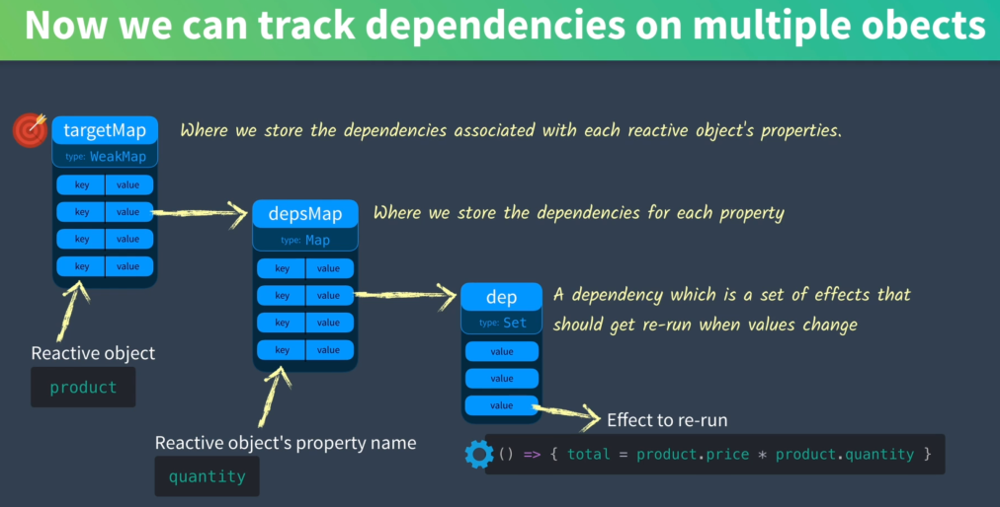

```js
const state = reactive({
  name:'黎明',
  age:18
})

effect(()=>{
  // 访问对象，触发get方法，收集对象的依赖
  console.log(state.name,state.age)
})

// 触发set方法，触发依赖函数
state.name = '黎明'
state.age = 20

```

# Proxy
Proxy 对象用于创建一个对象的代理，从而实现基本操作的拦截和自定义（如属性查找、赋值、枚举、函数调用等）。
```ts
const handler = {
  get: function (obj, prop) {
    return prop in obj ? obj[prop] : 37;
  },
};

const p = new Proxy({}, handler);
p.a = 1;
p.b = undefined;

console.log(p.a, p.b); // 1, undefined
console.log("c" in p, p.c); // false, 37

```

## [Proxy Limitations](https://javascript.info/proxy#proxy-limitations)

```js
let map = new Map();

let proxy = new Proxy(map, {});

proxy.set('test', 1); // Error
```
Internally, a Map stores all data in its [[MapData]] internal slot. The proxy doesn’t have such a slot. The built-in method Map.prototype.set method tries to access the internal property this.[[MapData]], but because this=proxy, can’t find it in proxy and just fails.

```js
let map = new Map();

let proxy = new Proxy(map, {
  get(target, prop, receiver) {
    let value = Reflect.get(...arguments);
    return typeof value == 'function' ? value.bind(target) : value;
  }
});

proxy.set('test', 1);
alert(proxy.get('test')); // 1 (works!)
```


```html

<!DOCTYPE html>
<html lang="en">

<head>
  <meta charset="UTF-8">
  <link rel="icon" href="/favicon.ico">
  <meta name="viewport" content="width=device-width, initial-scale=1.0">
  <title>Vite App</title>
  <script src="https://unpkg.com/vue@3/dist/vue.global.js"></script>
</head>

<body>
  <div id="app">

    {{ state.count }}
  </div>
  <script>
    const { createApp, reactive } = Vue
    debugger
    const state = reactive({
      count: 0
    })
    createApp({
      setup() {
        return {
          state
        }
      }
    }).mount('#app')
  </script>

</body>

</html>


```


# reactive

```ts
function reactive(){
  return new Proxy(obj,{
    get(target,key){
      //收集依赖
      track(target,key)
      return Reflect.get(target,key)
    },
    set(target,key,value){
      // 触发依赖
      trigger(target,key,value)
      return Reflect.set(target,key,value)
    }
  })
}

```
::: details reactive

```ts

/**
 * Returns a reactive proxy of the object.
 *
 * The reactive conversion is "deep": it affects all nested properties. A
 * reactive object also deeply unwraps any properties that are refs while
 * maintaining reactivity.
 *
 * @example
 * ```js
 * const obj = reactive({ count: 0 })
 * ```
 *
 * @param target - The source object.
 * @see {@link https://vuejs.org/api/reactivity-core.html#reactive}
 */
export function reactive<T extends object>(target: T): Reactive<T>
export function reactive(target: object) {
  // if trying to observe a readonly proxy, return the readonly version.
  if (isReadonly(target)) {
    return target
  }
  return createReactiveObject(
    target,
    false,
    mutableHandlers,
    mutableCollectionHandlers,
    reactiveMap,
  )
}

function createReactiveObject(
  target: Target,
  isReadonly: boolean,
  baseHandlers: ProxyHandler<any>,
  collectionHandlers: ProxyHandler<any>,
  proxyMap: WeakMap<Target, any>,
) {
  if (!isObject(target)) {
    if (__DEV__) {
      warn(
        `value cannot be made ${isReadonly ? 'readonly' : 'reactive'}: ${String(
          target,
        )}`,
      )
    }
    return target
  }
  // target is already a Proxy, return it.
  // exception: calling readonly() on a reactive object
  if (
    target[ReactiveFlags.RAW] &&
    !(isReadonly && target[ReactiveFlags.IS_REACTIVE])
  ) {
    return target
  }
  // target already has corresponding Proxy
  const existingProxy = proxyMap.get(target)
  if (existingProxy) {
    return existingProxy
  }
  // only specific value types can be observed.
  const targetType = getTargetType(target)
  if (targetType === TargetType.INVALID) {
    return target
  }
  const proxy = new Proxy(
    target,
    targetType === TargetType.COLLECTION ? collectionHandlers : baseHandlers,
  )
  proxyMap.set(target, proxy)
  return proxy
}

export const reactiveMap: WeakMap<Target, any> = new WeakMap<Target, any>()

enum TargetType {
  INVALID = 0,
  COMMON = 1,
  COLLECTION = 2,
}

function targetTypeMap(rawType: string) {
  switch (rawType) {
    case 'Object':
    case 'Array':
      return TargetType.COMMON
    case 'Map':
    case 'Set':
    case 'WeakMap':
    case 'WeakSet':
      return TargetType.COLLECTION
    default:
      return TargetType.INVALID
  }
}

```

:::


## handler

```ts
new Proxy(target, handler)
```
如果是`Map`,`Set`,`WeakMap`,`WeakSet`使用`collectionHandlers`，否则使用`baseHandlers`


### baseHandlers

代理对象是`object`,`Array`类型

```ts
const baseHandlers: ProxyHandler<object> = {
  get(target: Target, key: string | symbol, receiver: object) {
      const targetIsArray = isArray(target)
      // 如果是数组就返回数组的实例方法
      if(targetIsArray) {
        // arrayInstrumentations
        /*
        { 
           every(
              fn: (item: unknown, index: number, array: unknown[]) => unknown,
              thisArg?: unknown,
            ) {
              return apply(this, 'every', fn, thisArg, undefined, arguments)
            },
            //。。。
         }
        */ 
        return arrayInstrumentations[key]
      }
      const res = Reflect.get(
        target,
        key,
        // if this is a proxy wrapping a ref, return methods using the raw ref
        // as receiver so that we don't have to call `toRaw` on the ref in all
        // its class methods
        isRef(target) ? target : receiver,
      )
      track(target, 'get', key)

      return res
  }
  set(target: Target, key: string | symbol, value: unknown, receiver: object) {
      if (!hadKey) {
        trigger(target, TriggerOpTypes.ADD, key, value)
      } else if (hasChanged(value, oldValue)) {
        trigger(target, TriggerOpTypes.SET, key, value, oldValue)
      }    
  }
  deleteProperty(
    target: Record<string | symbol, unknown>,
    key: string | symbol,
  ): boolean {
    const hadKey = hasOwn(target, key)
    const oldValue = target[key]
    const result = Reflect.deleteProperty(target, key)
    if (result && hadKey) {
      trigger(target, TriggerOpTypes.DELETE, key, undefined, oldValue)
    }
    return result
  }

  has(target: Record<string | symbol, unknown>, key: string | symbol): boolean {
    const result = Reflect.has(target, key)
    if (!isSymbol(key) || !builtInSymbols.has(key)) {
      track(target, TrackOpTypes.HAS, key)
    }
    return result
  }

  ownKeys(target: Record<string | symbol, unknown>): (string | symbol)[] {
    track(
      target,
      TrackOpTypes.ITERATE,
      isArray(target) ? 'length' : ITERATE_KEY,
    )
    return Reflect.ownKeys(target)
  }

}

```


::: details baseHandlers

```ts

const baseHandlers = mutableHandlers
export const mutableHandlers: ProxyHandler<object> =
  /*@__PURE__*/ new MutableReactiveHandler()

class MutableReactiveHandler extends BaseReactiveHandler {
  constructor(isShallow = false) {
    super(false, isShallow)
  }

  set(
    target: Record<string | symbol, unknown>,
    key: string | symbol,
    value: unknown,
    receiver: object,
  ): boolean {
    let oldValue = target[key]
    if (!this._isShallow) {
      const isOldValueReadonly = isReadonly(oldValue)
      if (!isShallow(value) && !isReadonly(value)) {
        oldValue = toRaw(oldValue)
        value = toRaw(value)
      }
      if (!isArray(target) && isRef(oldValue) && !isRef(value)) {
        if (isOldValueReadonly) {
          return false
        } else {
          oldValue.value = value
          return true
        }
      }
    } else {
      // in shallow mode, objects are set as-is regardless of reactive or not
    }

    const hadKey =
      isArray(target) && isIntegerKey(key)
        ? Number(key) < target.length
        : hasOwn(target, key)
    const result = Reflect.set(
      target,
      key,
      value,
      isRef(target) ? target : receiver,
    )
    // don't trigger if target is something up in the prototype chain of original
    if (target === toRaw(receiver)) {
      if (!hadKey) {
        trigger(target, TriggerOpTypes.ADD, key, value)
      } else if (hasChanged(value, oldValue)) {
        trigger(target, TriggerOpTypes.SET, key, value, oldValue)
      }
    }
    return result
  }

  deleteProperty(
    target: Record<string | symbol, unknown>,
    key: string | symbol,
  ): boolean {
    const hadKey = hasOwn(target, key)
    const oldValue = target[key]
    const result = Reflect.deleteProperty(target, key)
    if (result && hadKey) {
      trigger(target, TriggerOpTypes.DELETE, key, undefined, oldValue)
    }
    return result
  }

  has(target: Record<string | symbol, unknown>, key: string | symbol): boolean {
    const result = Reflect.has(target, key)
    if (!isSymbol(key) || !builtInSymbols.has(key)) {
      track(target, TrackOpTypes.HAS, key)
    }
    return result
  }

  ownKeys(target: Record<string | symbol, unknown>): (string | symbol)[] {
    track(
      target,
      TrackOpTypes.ITERATE,
      isArray(target) ? 'length' : ITERATE_KEY,
    )
    return Reflect.ownKeys(target)
  }
}

class BaseReactiveHandler implements ProxyHandler<Target> {
  constructor(
    protected readonly _isReadonly = false,
    protected readonly _isShallow = false,
  ) {}

  get(target: Target, key: string | symbol, receiver: object): any {
    const isReadonly = this._isReadonly,
      isShallow = this._isShallow
    if (key === ReactiveFlags.IS_REACTIVE) {
      return !isReadonly
    } else if (key === ReactiveFlags.IS_READONLY) {
      return isReadonly
    } else if (key === ReactiveFlags.IS_SHALLOW) {
      return isShallow
    } else if (key === ReactiveFlags.RAW) {
      if (
        receiver ===
          (isReadonly
            ? isShallow
              ? shallowReadonlyMap
              : readonlyMap
            : isShallow
              ? shallowReactiveMap
              : reactiveMap
          ).get(target) ||
        // receiver is not the reactive proxy, but has the same prototype
        // this means the receiver is a user proxy of the reactive proxy
        Object.getPrototypeOf(target) === Object.getPrototypeOf(receiver)
      ) {
        return target
      }
      // early return undefined
      return
    }

    const targetIsArray = isArray(target)

    if (!isReadonly) {
      let fn: Function | undefined
      if (targetIsArray && (fn = arrayInstrumentations[key])) {
        return fn
      }
      if (key === 'hasOwnProperty') {
        return hasOwnProperty
      }
    }

    const res = Reflect.get(
      target,
      key,
      // if this is a proxy wrapping a ref, return methods using the raw ref
      // as receiver so that we don't have to call `toRaw` on the ref in all
      // its class methods
      isRef(target) ? target : receiver,
    )

    if (isSymbol(key) ? builtInSymbols.has(key) : isNonTrackableKeys(key)) {
      return res
    }

    if (!isReadonly) {
      track(target, TrackOpTypes.GET, key)
    }

    if (isShallow) {
      return res
    }

    if (isRef(res)) {
      // ref unwrapping - skip unwrap for Array + integer key.
      return targetIsArray && isIntegerKey(key) ? res : res.value
    }

    if (isObject(res)) {
      // Convert returned value into a proxy as well. we do the isObject check
      // here to avoid invalid value warning. Also need to lazy access readonly
      // and reactive here to avoid circular dependency.
      return isReadonly ? readonly(res) : reactive(res)
    }

    return res
  }
}
```

::: 


### collectionHandlers

`Map`,`Set`,`WeakMap`,`WeakSet`

集合类型的数据通过劫持原始数据的 get 行为绕过了 Proxy 的缺陷问题
劫持操作，一般都是获取原始数据然后获取原型方法，然后将 this 指向原始数据，再调用相关方法
对于查询操作，插入收集依赖的逻辑，然后返回响应式数据
对于修改操作，插入监听逻辑
对于迭代操作，插入收集依赖的逻辑，迭代过程中将数据转换成响应式的数据


```js
const collectionHandlers = {
  get(target, key, receiver) {
    //proxy 局限性 Map,Set等无法直接使用set
    return Reflect.get(hasOwn(instrumentations,key) && key in target ? instrumentations :target,key,receiver)
  }
}
const instrumentations = {
  get(target, key, receiver) { 
    track(target,get,key)
    return wrap(target.get(key))
  },
  size(target) {
    track(target,'iterate','Object iterate')
    return Reflect.get(target,'size',target)
  },
  has(target, key) {
    track(target,'has',key)
    return target.has(key)
  },
  // set
  add(target,value){
    if(!haskey) {
      target.add(value)
      trigger(target,'add',key,value)
    }
    return target
  },
  // Map类型
  set(target,key,value) {
    if(!hasKey){
      trigger(target,'add',key,value)
    }else {
      trigger(target,'set',key,value)
    }
    return target
  },
  delete(target,key) {
    const result = target.delete(key)
    return result
  },
  clear(target){
    const result = target.clear()
    if(hadItem){
      trigger(target,'clear')
    }
    return result
  }

}
[
   'keys',
   'values',
   'entries',
   Symbol.iterator,
].forEach(method => {
  collectionHandlers[method] = ()=> {
    // 返回一个迭代器
    const isPair =
      method === 'entries' || (method === Symbol.iterator && targetIsMap)
    return {
      next(){
        const {value,done} = innerIterator.next()
        return {
          value:  isPair ? [wrap(value[0]), wrap(value[1])] : wrap(value),
          done
        }
      },
      [Symbol.iterator](){
        return this
      }
    }
  }
}) 
```

::: details collectionHandlers

```ts
const collectionHanders = readonlyCollectionHandlers
export const readonlyCollectionHandlers: ProxyHandler<CollectionTypes> = {
  get: /*@__PURE__*/ createInstrumentationGetter(true, false),
}

function createInstrumentationGetter(isReadonly: boolean, shallow: boolean) {
  const instrumentations = createInstrumentations(isReadonly, shallow)

  return (
    target: CollectionTypes,
    key: string | symbol,
    receiver: CollectionTypes,
  ) => {
    if (key === ReactiveFlags.IS_REACTIVE) {
      return !isReadonly
    } else if (key === ReactiveFlags.IS_READONLY) {
      return isReadonly
    } else if (key === ReactiveFlags.RAW) {
      return target
    }

    return Reflect.get(
      hasOwn(instrumentations, key) && key in target
        ? instrumentations
        : target,
      key,
      receiver,
    )
  }
}
function createInstrumentations(
  readonly: boolean,
  shallow: boolean,
): Instrumentations {
  const instrumentations: Instrumentations = {
    /**
    首先获取原始的 target 数据 value 和 key
    如果 key 也是响应式数据的话，对 key 进行依赖收集
    对数据进行响应是处理并返回处理后的数据(即 Reactive 对象)   
     */    
    get(this: MapTypes, key: unknown) {
      // #1772: readonly(reactive(Map)) should return readonly + reactive version
      // of the value
      const target = this[ReactiveFlags.RAW]
      //  //获取原始的key，这里是因为Map中也可以使用对象作为key，所以对象也可能是响应式的
      const rawTarget = toRaw(target)
      const rawKey = toRaw(key)
      if (!readonly) {
        if (hasChanged(key, rawKey)) {
          track(rawTarget, TrackOpTypes.GET, key)
        }
        track(rawTarget, TrackOpTypes.GET, rawKey)
      }
      const { has } = getProto(rawTarget)
      const wrap = shallow ? toShallow : readonly ? toReadonly : toReactive
      if (has.call(rawTarget, key)) {
        return wrap(target.get(key))
      } else if (has.call(rawTarget, rawKey)) {
        return wrap(target.get(rawKey))
      } else if (target !== rawTarget) {
        // #3602 readonly(reactive(Map))
        // ensure that the nested reactive `Map` can do tracking for itself
        target.get(key)
      }
    },
    get size() {
      const target = (this as unknown as IterableCollections)[ReactiveFlags.RAW]
      !readonly && track(toRaw(target), TrackOpTypes.ITERATE, ITERATE_KEY)
      return Reflect.get(target, 'size', target)
    },
    has(this: CollectionTypes, key: unknown): boolean {
      const target = this[ReactiveFlags.RAW]
      const rawTarget = toRaw(target)
      const rawKey = toRaw(key)
      if (!readonly) {
        if (hasChanged(key, rawKey)) {
          track(rawTarget, TrackOpTypes.HAS, key)
        }
        track(rawTarget, TrackOpTypes.HAS, rawKey)
      }
      return key === rawKey
        ? target.has(key)
        : target.has(key) || target.has(rawKey)
    },
    forEach(this: IterableCollections, callback: Function, thisArg?: unknown) {
      const observed = this
      const target = observed[ReactiveFlags.RAW]
      const rawTarget = toRaw(target)
      const wrap = shallow ? toShallow : readonly ? toReadonly : toReactive
      !readonly && track(rawTarget, TrackOpTypes.ITERATE, ITERATE_KEY)
      return target.forEach((value: unknown, key: unknown) => {
        // important: make sure the callback is
        // 1. invoked with the reactive map as `this` and 3rd arg
        // 2. the value received should be a corresponding reactive/readonly.
        return callback.call(thisArg, wrap(value), wrap(key), observed)
      })
    },
  }

  extend(
    instrumentations,
    readonly
      ? {
          add: createReadonlyMethod(TriggerOpTypes.ADD),
          set: createReadonlyMethod(TriggerOpTypes.SET),
          delete: createReadonlyMethod(TriggerOpTypes.DELETE),
          clear: createReadonlyMethod(TriggerOpTypes.CLEAR),
        }
      : {
          add(this: SetTypes, value: unknown) {
            if (!shallow && !isShallow(value) && !isReadonly(value)) {
              value = toRaw(value)
            }
            const target = toRaw(this)
            const proto = getProto(target)
            const hadKey = proto.has.call(target, value)
            if (!hadKey) {
              target.add(value)
              trigger(target, TriggerOpTypes.ADD, value, value)
            }
            return this
          },
          set(this: MapTypes, key: unknown, value: unknown) {
            if (!shallow && !isShallow(value) && !isReadonly(value)) {
              value = toRaw(value)
            }
            const target = toRaw(this)
            const { has, get } = getProto(target)

            let hadKey = has.call(target, key)
            if (!hadKey) {
              key = toRaw(key)
              hadKey = has.call(target, key)
            } else if (__DEV__) {
              checkIdentityKeys(target, has, key)
            }

            const oldValue = get.call(target, key)
            target.set(key, value)
            if (!hadKey) {
              trigger(target, TriggerOpTypes.ADD, key, value)
            } else if (hasChanged(value, oldValue)) {
              trigger(target, TriggerOpTypes.SET, key, value, oldValue)
            }
            return this
          },
          delete(this: CollectionTypes, key: unknown) {
            const target = toRaw(this)
            const { has, get } = getProto(target)
            let hadKey = has.call(target, key)
            if (!hadKey) {
              key = toRaw(key)
              hadKey = has.call(target, key)
            } else if (__DEV__) {
              checkIdentityKeys(target, has, key)
            }

            const oldValue = get ? get.call(target, key) : undefined
            // forward the operation before queueing reactions
            const result = target.delete(key)
            if (hadKey) {
              trigger(target, TriggerOpTypes.DELETE, key, undefined, oldValue)
            }
            return result
          },
          clear(this: IterableCollections) {
            const target = toRaw(this)
            const hadItems = target.size !== 0
            const oldTarget = __DEV__
              ? isMap(target)
                ? new Map(target)
                : new Set(target)
              : undefined
            // forward the operation before queueing reactions
            const result = target.clear()
            if (hadItems) {
              trigger(
                target,
                TriggerOpTypes.CLEAR,
                undefined,
                undefined,
                oldTarget,
              )
            }
            return result
          },
        },
  )

  const iteratorMethods = [
    'keys',
    'values',
    'entries',
    Symbol.iterator,
  ] as const

  iteratorMethods.forEach(method => {
    instrumentations[method] = createIterableMethod(method, readonly, shallow)
  })

  return instrumentations
}
function createIterableMethod(
  method: string | symbol,
  isReadonly: boolean,
  isShallow: boolean,
) {
  return function (
    this: IterableCollections,
    ...args: unknown[]
  ): Iterable<unknown> & Iterator<unknown> {
    const target = this[ReactiveFlags.RAW]
    const rawTarget = toRaw(target)
    const targetIsMap = isMap(rawTarget)
    const isPair =
      method === 'entries' || (method === Symbol.iterator && targetIsMap)
    const isKeyOnly = method === 'keys' && targetIsMap
    const innerIterator = target[method](...args)
    const wrap = isShallow ? toShallow : isReadonly ? toReadonly : toReactive
    !isReadonly &&
      track(
        rawTarget,
        TrackOpTypes.ITERATE,
        isKeyOnly ? MAP_KEY_ITERATE_KEY : ITERATE_KEY,
      )
    // return a wrapped iterator which returns observed versions of the
    // values emitted from the real iterator
    return {
      // iterator protocol
      next() {
        const { value, done } = innerIterator.next()
        return done
          ? { value, done }
          : {
              value: isPair ? [wrap(value[0]), wrap(value[1])] : wrap(value),
              done,
            }
      },
      // iterable protocol
      [Symbol.iterator]() {
        return this
      },
    }
  }
}
```

:::

# ref

`Getters/setters`
```js
class User {

  constructor(name) {
    // 调用 setter
    this.name = name;
  }

  get name() {
    return this._name;
  }

  set name(value) {
    if (value.length < 4) {
      alert("Name is too short.");
      return;
    }
    this._name = value;
  }

}

let user = new User("John");
alert(user.name); // John

user = new User(""); // Name is too short.
```
`ref`
```ts
export function ref(value?: unknown) {
  return createRef(value, false)
}
function createRef(rawValue: unknown, shallow: boolean) {
  if (isRef(rawValue)) {
    return rawValue
  }
  return new RefImpl(rawValue, shallow)
}
class RefImpl<T = any> {
  _value: T
  private _rawValue: T

  dep: Dep = new Dep()
  constructor(value: T, isShallow: boolean) {
    this._rawValue = isShallow ? value : toRaw(value)
    this._value = isShallow ? value : toReactive(value)
  }

  get value() {
    this.dep.track()
    return this._value
  }

  set value(newValue) {
    const oldValue = this._rawValue
    if (hasChanged(newValue, oldValue)) {
      this._rawValue = newValue
      this._value = newValue 
      this.dep.trigger()
    }
  }
}

```

::: details RefImpl
```ts
class RefImpl<T = any> {
  _value: T
  private _rawValue: T

  dep: Dep = new Dep()

  public readonly [ReactiveFlags.IS_REF] = true
  public readonly [ReactiveFlags.IS_SHALLOW]: boolean = false

  constructor(value: T, isShallow: boolean) {
    this._rawValue = isShallow ? value : toRaw(value)
    this._value = isShallow ? value : toReactive(value)
    this[ReactiveFlags.IS_SHALLOW] = isShallow
  }

  get value() {
    if (__DEV__) {
      this.dep.track({
        target: this,
        type: TrackOpTypes.GET,
        key: 'value',
      })
    } else {
      this.dep.track()
    }
    return this._value
  }

  set value(newValue) {
    const oldValue = this._rawValue
    const useDirectValue =
      this[ReactiveFlags.IS_SHALLOW] ||
      isShallow(newValue) ||
      isReadonly(newValue)
    newValue = useDirectValue ? newValue : toRaw(newValue)
    if (hasChanged(newValue, oldValue)) {
      this._rawValue = newValue
      this._value = useDirectValue ? newValue : toReactive(newValue)
      if (__DEV__) {
        this.dep.trigger({
          target: this,
          type: TriggerOpTypes.SET,
          key: 'value',
          newValue,
          oldValue,
        })
      } else {
        this.dep.trigger()
      }
    }
  }
}


```
:::

# Effect

```ts
it('should observe basic properties', () => {
  let dummy
  const counter = reactive({ num: 0 })
  effect(() => (dummy = counter.num))
  expect(dummy).toBe(0)
  counter.num = 7
  expect(dummy).toBe(7)
})
```


effect是 reactive 的核心，主要负责收集依赖，更新依赖
```ts
function effect(fn){
  const e = new ReactiveEffect(fn)
  e.run()
}
class ReactiveEffect {
  constructor(public fn: any) {
    if (activeEffectScope && activeEffectScope.active) {
      activeEffectScope.effects.push(this)
    }
  }
  run(){
    //  effect 从 deps 数组中移除，然后清空 deps 数组。
    cleanupEffect(this)
    //  
    prepareDeps(this)
    activeSub = this
    shouldTrack = true
    // 触发track收集
    this.fn()
  }
}
```
访问reactive数据会触发get拦截进行track进行依赖收集
```ts
function track(target,type,key) {
   if (shouldTrack && activeSub) { 
    dep.track({target,type,key})
   //  ....
   }
}
class Dep{
  track(){
    let link = this.activeLink = new Link(activeSub,this)
    addSub(link)
  }
}
// 建立一个链表来管理依赖 link.sub = effect link.dep = Dep
function addSub(link) {
    const currentTail = link.dep.subs
    // 更新订阅者链表
    if (currentTail !== link) {
      link.prevSub = currentTail
      if (currentTail) currentTail.nextSub = link
    } 
    // 更新订阅者链表 
    link.dep.subs = link
}
```
更改reactive属性数据，会触发set拦截，进行trigger触发依赖更新
```ts
function trigger(target,type,key,newValue,oldValue,oldTarget) {
  const run = (dep) => {dep.trigger()}
  startBatch()
  // 获取收集的依赖
  const depsMap = targetMap.get(target)
  depsMap.forEach(run)
}
class Dep{
  trigger(){
    this.notify()
  },
  notify(){
    starBatch()
    // 遍历订阅者链表，触发effect
      for (let link = this.subs; link; link = link.prevSub) {
        if (link.sub.notify()) {
          ;(link.sub as ComputedRefImpl).dep.notify()
        }
    }
    endBatch()
  }
}
class ReactiveEffect{
  notify(){
    batch(this)
  },
  trigger(){
    //  派发更新
  }
}
let batchDepth = 0
function starBatch(){
  batchDepth ++
}
function batch(sub) {
   batchedSub = sub
}
function endBatch(){
  if(--batchDepth === 0){
    return
  }
  batchedSub.trigger()
}
```


::: details effect
```ts
export function effect<T = any>(
  fn: () => T,
  options?: ReactiveEffectOptions,
): ReactiveEffectRunner<T> {
  // // 如果传入的fn本身就是effect，那么就直接执行 effect的副作用
  if ((fn as ReactiveEffectRunner).effect instanceof ReactiveEffect) {
    fn = (fn as ReactiveEffectRunner).effect.fn
  }

  const e = new ReactiveEffect(fn)
  if (options) {
    extend(e, options)
  }
  try {
    e.run()
  } catch (err) {
    e.stop()
    throw err
  }
  const runner = e.run.bind(e) as ReactiveEffectRunner
  runner.effect = e
  return runner
}
export let activeEffectScope: EffectScope | undefined

export class ReactiveEffect<T = any>
  implements Subscriber, ReactiveEffectOptions
{
  /**
   * @internal
   */
  deps?: Link = undefined
  /**
   * @internal
   */
  depsTail?: Link = undefined
  /**
   * @internal
   */
  flags: EffectFlags = EffectFlags.ACTIVE | EffectFlags.TRACKING
  /**
   * @internal
   */
  next?: Subscriber = undefined
  /**
   * @internal
   */
  cleanup?: () => void = undefined

  scheduler?: EffectScheduler = undefined
  onStop?: () => void
  onTrack?: (event: DebuggerEvent) => void
  onTrigger?: (event: DebuggerEvent) => void

  constructor(public fn: () => T) {
    if (activeEffectScope && activeEffectScope.active) {
      activeEffectScope.effects.push(this)
    }
  }

  pause(): void {
    this.flags |= EffectFlags.PAUSED
  }

  resume(): void {
    if (this.flags & EffectFlags.PAUSED) {
      this.flags &= ~EffectFlags.PAUSED
      if (pausedQueueEffects.has(this)) {
        pausedQueueEffects.delete(this)
        this.trigger()
      }
    }
  }

  /**
   * @internal
   */
  notify(): void {
    if (
      this.flags & EffectFlags.RUNNING &&
      !(this.flags & EffectFlags.ALLOW_RECURSE)
    ) {
      return
    }
    if (!(this.flags & EffectFlags.NOTIFIED)) {
      batch(this)
    }
  }

  run(): T {
    // TODO cleanupEffect

    if (!(this.flags & EffectFlags.ACTIVE)) {
      // stopped during cleanup
      return this.fn()
    }

    this.flags |= EffectFlags.RUNNING
    cleanupEffect(this)
    prepareDeps(this)
    const prevEffect = activeSub
    const prevShouldTrack = shouldTrack
    activeSub = this
    shouldTrack = true

    try {
      return this.fn()
    } finally {
      if (__DEV__ && activeSub !== this) {
        warn(
          'Active effect was not restored correctly - ' +
            'this is likely a Vue internal bug.',
        )
      }
      cleanupDeps(this)
      activeSub = prevEffect
      shouldTrack = prevShouldTrack
      this.flags &= ~EffectFlags.RUNNING
    }
  }

  stop(): void {
    if (this.flags & EffectFlags.ACTIVE) {
      for (let link = this.deps; link; link = link.nextDep) {
        removeSub(link)
      }
      this.deps = this.depsTail = undefined
      cleanupEffect(this)
      this.onStop && this.onStop()
      this.flags &= ~EffectFlags.ACTIVE
    }
  }

  trigger(): void {
    if (this.flags & EffectFlags.PAUSED) {
      pausedQueueEffects.add(this)
    } else if (this.scheduler) {
      this.scheduler()
    } else {
      this.runIfDirty()
    }
  }

  /**
   * @internal
   */
  runIfDirty(): void {
    if (isDirty(this)) {
      this.run()
    }
  }

  get dirty(): boolean {
    return isDirty(this)
  }
}

```

:::

# Dep

- `targetMap`:存储了每个 "响应性对象属性" 关联的依赖；类型是 WeakMap
- `depsMap`: 存储了每个属性的依赖；类型是 Map
- `dep`: 存储了 effects ，一个 effects 集，这些 effect 在值发生变化时重新运行;类型是 Set



```ts
//  存储effects ，一个 effects 集，这些 effect 在值发生变化时重新运行
class Dep {
  activeLink = undefined
  track(){
    // activeSub = ReactiveEffect
    link = this.activeLink = new Link(activeSub,this)
    // 建立链表，将链表的当前指向link,上一个link改为prevSub
    addSub(link)
  }
  trigger(){
    this.notify()
  }
  notify(){
    startBatch()
    try {
      // 循环遍历链表
      for (let link = this.subs; link; link = link.prevSub) {
        if (link.sub.notify()) {
          ;(link.sub as ComputedRefImpl).dep.notify()
        }
      }
    } finally {
      endBatch()
    }
  }
}
// 存储了每个 "响应性对象属性" 关联的依赖
export const targetMap: WeakMap<object, KeyToDepMap> = new WeakMap()

function track(target,type,key) {
    let depsMap = targetMap.get(target)
    if (!depsMap) {
      //depsMap 存储了每个属性的依赖；
      targetMap.set(target, (depsMap = new Map()))
    }
    let dep = depsMap.get(key)
    if (!dep) {
      depsMap.set(key, (dep = new Dep()))
      dep.map = depsMap
      dep.key = key
    }
    dep.track()
    
}
function trigger(target,type,key,newValue,oldValue,oldTarget) {
  const depsMap = targetMap.get(target)
  const run = dep => dep.trigger()
  startBatch()
  depsMap.forEach(run)
  endBatch()
}

```


::: details track

```ts
export const targetMap: WeakMap<object, KeyToDepMap> = new WeakMap()

/**
 * Tracks access to a reactive property.
 *
 * This will check which effect is running at the moment and record it as dep
 * which records all effects that depend on the reactive property.
 *
 * @param target - Object holding the reactive property.
 * @param type - Defines the type of access to the reactive property.
 * @param key - Identifier of the reactive property to track.
 */
export function track(target: object, type: TrackOpTypes, key: unknown): void {
  if (shouldTrack && activeSub) {
    let depsMap = targetMap.get(target)
    if (!depsMap) {
      targetMap.set(target, (depsMap = new Map()))
    }
    let dep = depsMap.get(key)
    if (!dep) {
      depsMap.set(key, (dep = new Dep()))
      dep.map = depsMap
      dep.key = key
    }
    if (__DEV__) {
      dep.track({
        target,
        type,
        key,
      })
    } else {
      dep.track()
    }
  }
}

```
:::

::: details trigger

```ts
/**
 * Finds all deps associated with the target (or a specific property) and
 * triggers the effects stored within.
 *
 * @param target - The reactive object.
 * @param type - Defines the type of the operation that needs to trigger effects.
 * @param key - Can be used to target a specific reactive property in the target object.
 */
export function trigger(
  target: object,
  type: TriggerOpTypes,
  key?: unknown,
  newValue?: unknown,
  oldValue?: unknown,
  oldTarget?: Map<unknown, unknown> | Set<unknown>,
): void {
  const depsMap = targetMap.get(target)
  if (!depsMap) {
    // never been tracked
    globalVersion++
    return
  }

  const run = (dep: Dep | undefined) => {
    if (dep) {
      if (__DEV__) {
        dep.trigger({
          target,
          type,
          key,
          newValue,
          oldValue,
          oldTarget,
        })
      } else {
        dep.trigger()
      }
    }
  }

  startBatch()

  if (type === TriggerOpTypes.CLEAR) {
    // collection being cleared
    // trigger all effects for target
    depsMap.forEach(run)
  } else {
    const targetIsArray = isArray(target)
    const isArrayIndex = targetIsArray && isIntegerKey(key)

    if (targetIsArray && key === 'length') {
      const newLength = Number(newValue)
      depsMap.forEach((dep, key) => {
        if (
          key === 'length' ||
          key === ARRAY_ITERATE_KEY ||
          (!isSymbol(key) && key >= newLength)
        ) {
          run(dep)
        }
      })
    } else {
      // schedule runs for SET | ADD | DELETE
      if (key !== void 0 || depsMap.has(void 0)) {
        run(depsMap.get(key))
      }

      // schedule ARRAY_ITERATE for any numeric key change (length is handled above)
      if (isArrayIndex) {
        run(depsMap.get(ARRAY_ITERATE_KEY))
      }

      // also run for iteration key on ADD | DELETE | Map.SET
      switch (type) {
        case TriggerOpTypes.ADD:
          if (!targetIsArray) {
            run(depsMap.get(ITERATE_KEY))
            if (isMap(target)) {
              run(depsMap.get(MAP_KEY_ITERATE_KEY))
            }
          } else if (isArrayIndex) {
            // new index added to array -> length changes
            run(depsMap.get('length'))
          }
          break
        case TriggerOpTypes.DELETE:
          if (!targetIsArray) {
            run(depsMap.get(ITERATE_KEY))
            if (isMap(target)) {
              run(depsMap.get(MAP_KEY_ITERATE_KEY))
            }
          }
          break
        case TriggerOpTypes.SET:
          if (isMap(target)) {
            run(depsMap.get(ITERATE_KEY))
          }
          break
      }
    }
  }

  endBatch()
}

```

:::

::: details Dep

```ts

export class Dep {
  version = 0
  /**
   * Link between this dep and the current active effect
   */
  activeLink?: Link = undefined

  /**
   * Doubly linked list representing the subscribing effects (tail)
   */
  subs?: Link = undefined

  /**
   * Doubly linked list representing the subscribing effects (head)
   * DEV only, for invoking onTrigger hooks in correct order
   */
  subsHead?: Link

  /**
   * For object property deps cleanup
   */
  map?: KeyToDepMap = undefined
  key?: unknown = undefined

  /**
   * Subscriber counter
   */
  sc: number = 0

  constructor(public computed?: ComputedRefImpl | undefined) {
    if (__DEV__) {
      this.subsHead = undefined
    }
  }

  track(debugInfo?: DebuggerEventExtraInfo): Link | undefined {
    if (!activeSub || !shouldTrack || activeSub === this.computed) {
      return
    }

    let link = this.activeLink
    if (link === undefined || link.sub !== activeSub) {
      link = this.activeLink = new Link(activeSub, this)

      // add the link to the activeEffect as a dep (as tail)
      if (!activeSub.deps) {
        activeSub.deps = activeSub.depsTail = link
      } else {
        link.prevDep = activeSub.depsTail
        activeSub.depsTail!.nextDep = link
        activeSub.depsTail = link
      }

      addSub(link)
    } else if (link.version === -1) {
      // reused from last run - already a sub, just sync version
      link.version = this.version

      // If this dep has a next, it means it's not at the tail - move it to the
      // tail. This ensures the effect's dep list is in the order they are
      // accessed during evaluation.
      if (link.nextDep) {
        const next = link.nextDep
        next.prevDep = link.prevDep
        if (link.prevDep) {
          link.prevDep.nextDep = next
        }

        link.prevDep = activeSub.depsTail
        link.nextDep = undefined
        activeSub.depsTail!.nextDep = link
        activeSub.depsTail = link

        // this was the head - point to the new head
        if (activeSub.deps === link) {
          activeSub.deps = next
        }
      }
    }

    if (__DEV__ && activeSub.onTrack) {
      activeSub.onTrack(
        extend(
          {
            effect: activeSub,
          },
          debugInfo,
        ),
      )
    }

    return link
  }

  trigger(debugInfo?: DebuggerEventExtraInfo): void {
    this.version++
    globalVersion++
    this.notify(debugInfo)
  }

  notify(debugInfo?: DebuggerEventExtraInfo): void {
    startBatch()
    try {
      if (__DEV__) {
        // subs are notified and batched in reverse-order and then invoked in
        // original order at the end of the batch, but onTrigger hooks should
        // be invoked in original order here.
        for (let head = this.subsHead; head; head = head.nextSub) {
          if (head.sub.onTrigger && !(head.sub.flags & EffectFlags.NOTIFIED)) {
            head.sub.onTrigger(
              extend(
                {
                  effect: head.sub,
                },
                debugInfo,
              ),
            )
          }
        }
      }
      for (let link = this.subs; link; link = link.prevSub) {
        if (link.sub.notify()) {
          // if notify() returns `true`, this is a computed. Also call notify
          // on its dep - it's called here instead of inside computed's notify
          // in order to reduce call stack depth.
          ;(link.sub as ComputedRefImpl).dep.notify()
        }
      }
    } finally {
      endBatch()
    }
  }
}

function addSub(link: Link) {
  link.dep.sc++
  if (link.sub.flags & EffectFlags.TRACKING) {
    const computed = link.dep.computed
    // computed getting its first subscriber
    // enable tracking + lazily subscribe to all its deps
    if (computed && !link.dep.subs) {
      computed.flags |= EffectFlags.TRACKING | EffectFlags.DIRTY
      for (let l = computed.deps; l; l = l.nextDep) {
        addSub(l)
      }
    }

    const currentTail = link.dep.subs
    if (currentTail !== link) {
      link.prevSub = currentTail
      if (currentTail) currentTail.nextSub = link
    }

    if (__DEV__ && link.dep.subsHead === undefined) {
      link.dep.subsHead = link
    }

    link.dep.subs = link
  }
}
```

:::

