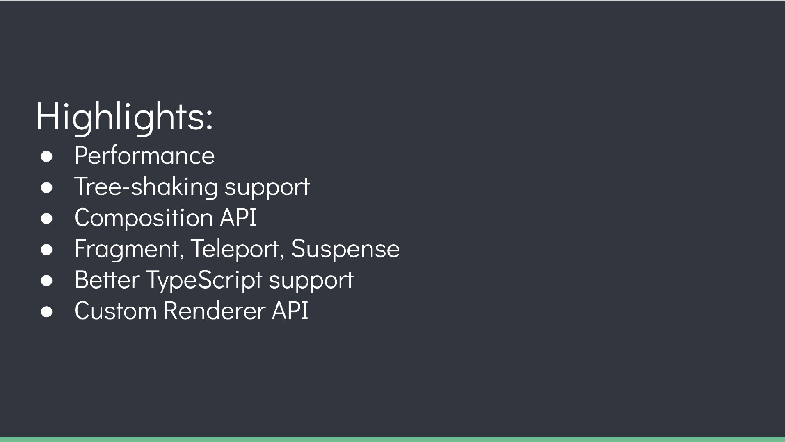
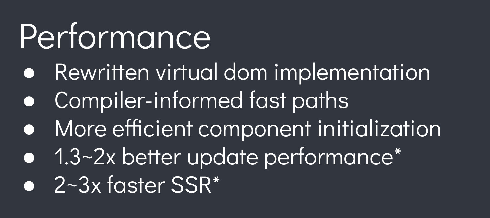
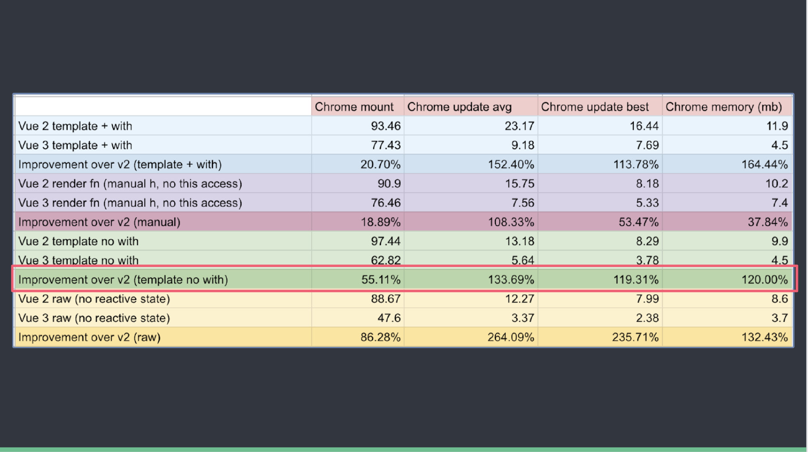
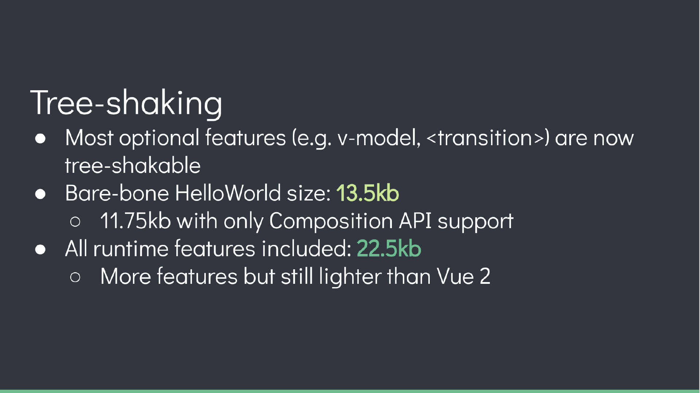
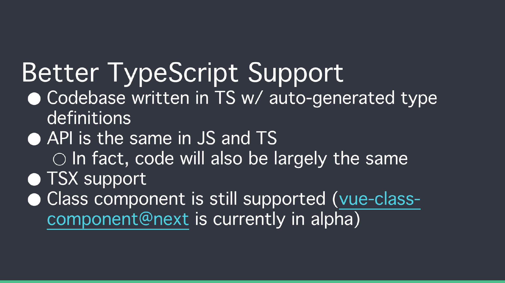
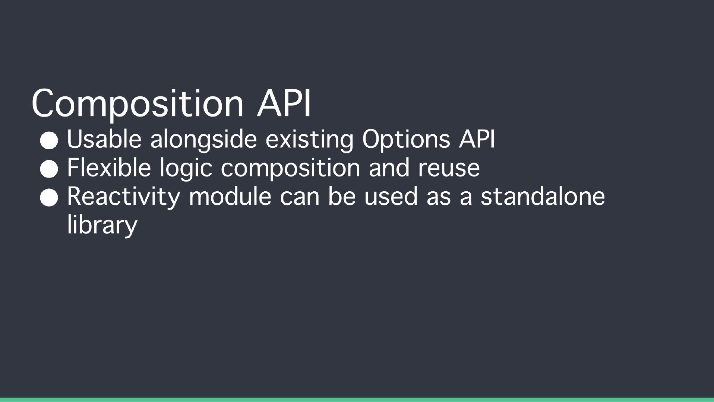
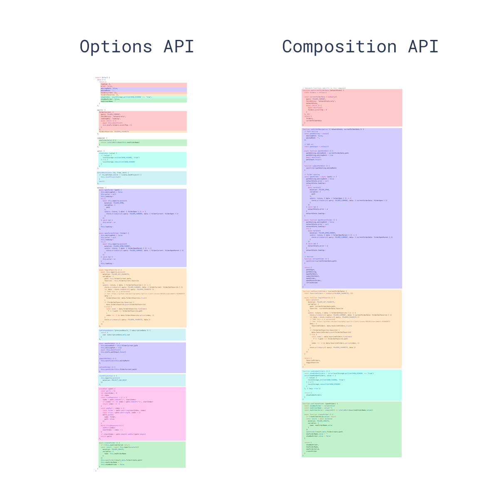
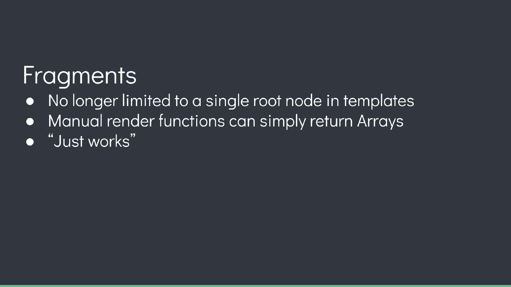

## Performance


## diff 算法的优化

vue2 中的虚拟 dom 是全量的对比（每个节点不论写死的还是动态的都会一层一层比较，这就浪费了大部分事件在对比静态节点上）

vue3 新增了静态标记（patchflag）与上次虚拟节点对比时，只对比带有 patch flag 的节点（动态数据所在的节点）；可通过 flag 信息得知当前节点要对比的具体内容。

## hoistStatic 静态提升
vue2无论元素是否参与更新，每次都会重新创建然后再渲染。
vue3对于不参与更新的元素，会做静态提升，只会被创建一次，在渲染时直接复用即可。

## 更高效的组件初始化
Vue2组件必须有一个跟节点
```vue
<template>
<div>1</div>
<div>2</div>
</template>
```

### cacheHandlers 事件侦听器缓存
vue2.x中，绑定事件每次触发都要重新生成全新的function去更新，cacheHandlers 是Vue3中提供的事件缓存对象，当 cacheHandlers 开启，会自动生成一个内联函数，同时生成一个静态节点。当事件再次触发时，只需从缓存中调用即可，无需再次更新。
默认情况下onClick会被视为动态绑定，所以每次都会追踪它的变化，但是同一个函数没必要追踪变化，直接缓存起来复用即可。

## Three Shaking

Vue 3.0 中没有被用到的模块可以不被打包到编译后的文件中，被 TreeShake 掉。当只有一个HelloWorld的时候 Vue3打包后 13.5kb。所有的组件全部加载进来时是 22.5kb

## 更好的ts支持


## Composition API




## Fragment

类似于react的<></>

## Teleport

类似react的 portal
**但因为Chrome有个提案，会增加一个名为Portal的原生element，为避免命名冲突，改为Teleport**
