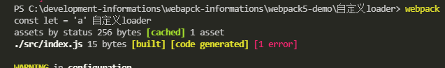
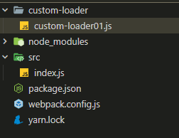
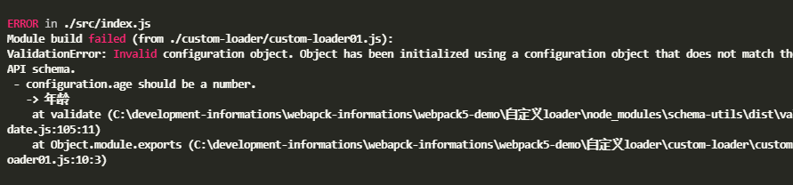

Loader 是用于对模块的源代码进行转换（处理），之前我们已经使用过很多 Loader，比如 css-loader、style-loader、babel-loader 等。

## loader 本质

Loader 本质上是一个导出为函数的 JavaScript 模块；
loader runner 库会调用这个函数，然后将上一个 loader 产生的结果或者资源文件传入进去；

loader 返回必须是一个 buffer 或者`javascript字符串`

`自定义loader`

```js
//content：资源文件的内容；
//map：sourcemap相关的数据；
//meta：一些元数据
module.exports = function (content, map, meta) {
  console.log(content, "自定义loader");
  return content;
};
```

`webpack.config.js`

```js
const path = require("path");
module.exports = {
  context: path.resolve(__dirname, ""),
  module: {
    rules: [
      {
        test: /\.js$/i,
        use: "./custom-loader/custom-loader",
      },
    ],
  },
};
```



## `resolveLoader`

指定 loader 所在的位置

`webpack.config.js`

```js
const path = require("path");
module.exports = {
  mode: development,
  context: path.resolve(__dirname, ""),
  module: {
    rules: [
      {
        test: /\.js$/i,
        use: "custom-loader01",
      },
    ],
  },
  resolveLoader: {
    modules: ["node_modules", "./custom-loader"],
  },
};
```



## loader 执行顺序

loader 总是 从右到左被调用。有些情况下，loader 只关心 request 后面的 元数据(metadata)，并且忽略前一个 loader 的结果。在实际（从右到左）执行 loader 之前，会先 从左到右 调用 loader 上的 pitch 方法。

## **enforce**

指定 loader 种类。没有值表示是普通 loader。

**Pitching 阶段:** loader 上的 pitch 方法，按照 后置(post)、行内(inline)、普通(normal)、前置(pre) 的顺序调用。
**Normal 阶段:** loader 上的 常规方法，按照 前置(pre)、普通(normal)、行内(inline)、后置(post) 的顺序调用。模块源码的转换， 发生在这个阶段。

`webpack.config.js`

```js
{
    test:/\.js$/i,
    use:'loader',
    enforce:'pre'
}
```

## 同步 loader

默认创建的 Loader 就是同步的 Loader；
这个 Loader 必须通过 return 或者 `this.callback `来返回结果，交给下一个 loader 来处理；
通常在有错误的情况下，我们会使用 `this.callback`；

`webpack.config.js`

```js
module.exports = function (content) {
  // return content
  //第一个参数必须是 Error 或者 null；
  //第二个参数是一个 string或者Buffer；
  this.callback(null, content);
};
```

## 异步 loader

`webpack.config.js`

```js
module.exports = function (content) {
  const callback = this.async();

  setTimeout(() => {
    callback(null, content);
  }, 2000);
};
```

## 获取传入参数

```shell
npm i loader-utils
```

`webpack.config.js`

```js
      {
        test: /\.js$/i,
        use: {
          loader: "custom-loader01",
          options: {
            name: "lu",
            age: "18",
          },
        },
      },
```

`custom-loader.js`

```js
const { getOptions } = require("loader-utils");

//NormalLoader
//异步
module.exports = function (content) {
  const options = getOptions(this);
  console.log(options, "options");
  const callback = this.async();

  setTimeout(() => {
    callback(null, content);
  }, 2000);
};
```


## 校验传入参数

```shell
npm i schema-utils -D
```

`custom-schema.json`

```json
{
  "type": "object",
  "properties": {
    "name": {
      "type": "string",
      "description": "名字"
    },
    "age": {
      "type": "number",
      "description": "年龄"
    }
  }
}
```

`webpack.config.js`

```js
      {
        test: /\.js$/i,
        use: {
          loader: "custom-loader01",
          options: {
            name: "lu",
            age: "18",
          },
        },
      },
```

`custom-loader.js`

```js
const { getOptions } = require("loader-utils");
const { validate } = require("schema-utils");
const schema = require("../custom-schema/custom-schema.json");
//NormalLoader
//异步
module.exports = function (content) {
  const options = getOptions(this);
  console.log(options, "options");
  validate(schema, options);
  const callback = this.async();
  setTimeout(() => {
    callback(null, content);
  }, 2000);
};
```



## loader 运行的总体流程


