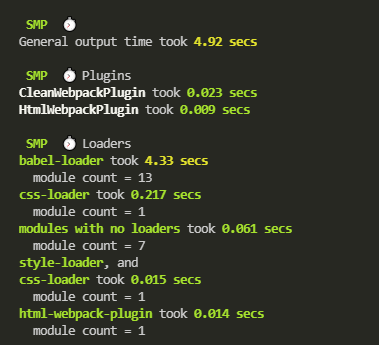
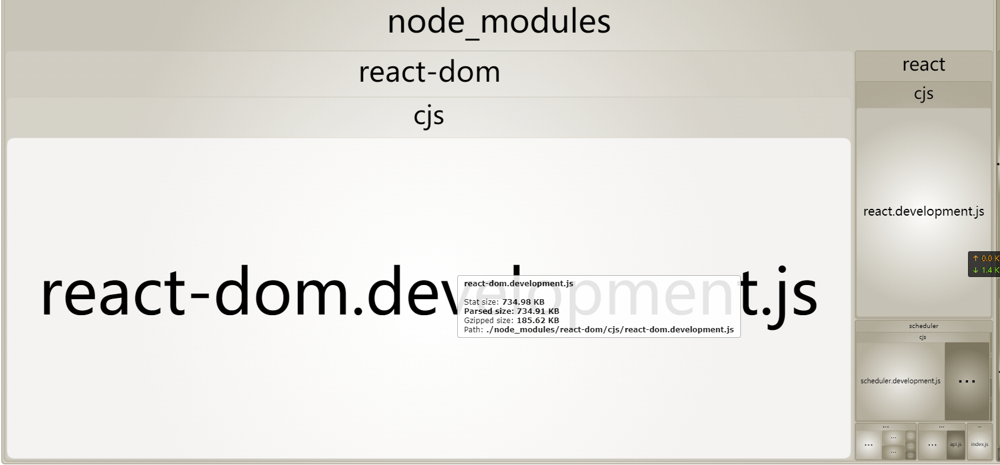

## 打包时间分析

```shell
npm install speed-measure-webpack-plugin -D
```

`webpack.config.js`

```js
const SpeedMeasurePlugin = require("speed-measure-webpack-plugin");
const smp = new SpeedMeasurePlugin();
const config = {
    //........
    // webpack的配置
}
module.exports = smp.wrap(config)
```



## 打包后文件分析

```shell
npm install webpack-bundle-analyzer -D
```

`webpack.config.js`

```js
const BundleAnalyzerPlugin =
  require("webpack-bundle-analyzer").BundleAnalyzerPlugin;
module.exports = {
    //....
    plugins:[
        new BundleAnalyzerPlugin()
    ]
}

```




