## source-map

**代码通常运行在浏览器上时，是通过打包压缩的：**

- 也就是真实跑在浏览器上的代码，和我们编写的代码其实是有差异的；
- 比如ES6的代码可能被转换成ES5；
- 比如对应的代码行号、列号在经过编译后肯定会不一致；
- 比如代码进行丑化压缩时，会将编码名称等修改；
- 比如我们使用了TypeScript等方式编写的代码，最终转换成JavaScript；


**source-map是从已转换的代码，映射到原始的源文件；**
**使浏览器可以重构原始源并在调试器中显示重建的原始源；**


### 使用source-map

第一步：根据源文件，生成source-map文件，webpack在打包时，可以通过配置生成source-map；

`webpack.config.js`

```js
module.exports = {
  devtool: "source-map",
}
```


第二步：在转换后的代码，最后添加一个注释，它指向sourcemap；

```js
//# sourceMappingURL=main.js.map
```

在浏览器中开启

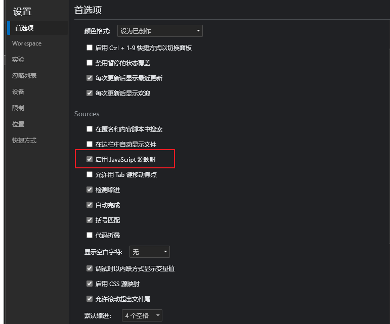


### source-map源码

- version：当前使用的版本，也就是最新的第三版；
- sources：从哪些文件转换过来的source-map和打包的代码（最初始的文件）；
- names：转换前的变量和属性名称（因为我目前使用的是development模式，所以不需要保留转换前的名称）；
- mappings：source-map用来和源文件映射的信息（比如位置信息等），一串base64 VLQ（veriable-length quantity可变长度值）编码；
- file：打包后的文件（浏览器加载的文件）；
- sourceContent：转换前的具体代码信息（和sources是对应的关系）；
- sourceRoot：所有的sources相对的根目录；

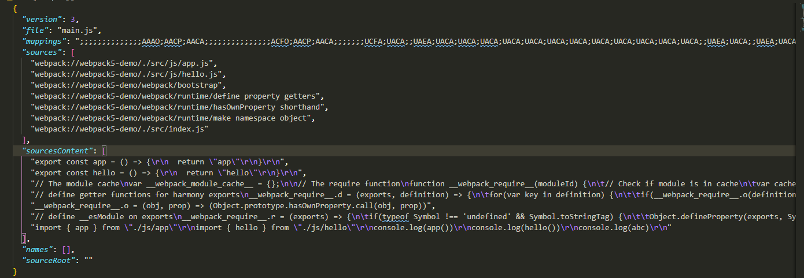


### 生成source-map

[配置`devtool`](https://webpack.docschina.org/configuration/devtool/)


**不会生成source-map**

- false：不使用source-map，也就是没有任何和source-map相关的内容。
- none：production模式下的默认值，不生成source-map。
-  eval：development模式下的默认值，不生成source-map
- - 但是它会在eval执行的代码中，添加 //# sourceURL=；
  - 它会被浏览器在执行时解析，并且在调试面板中生成对应的一些文件目录，方便我们调试代码；

## `eval`

不会生成每个source map文件，模块都封装在eval中，并在里面添加//# sourceURL = xx.js

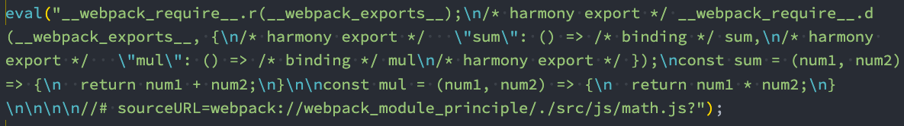

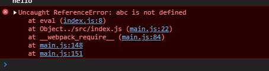


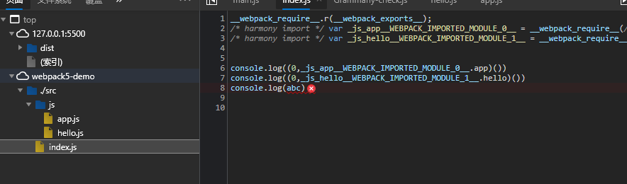


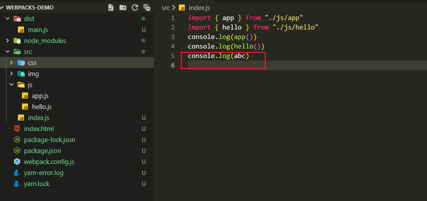


## `source-map`

能完整的找到报错代码地址

`webpack.config.js`

```js
module.exports = {
  devtool: "source-map",
}
```

生成一个独立的source-map文件，并且在bundle文件中有一个注释，指向source-map文件；

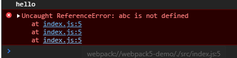


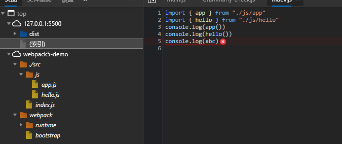


## eval-source-map

把eval的sourceURL换为完整sourcemap信息的DataURL

会生成sourcemap，**但是source-map是以DataUrl添加到eval函数的后面**

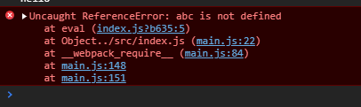

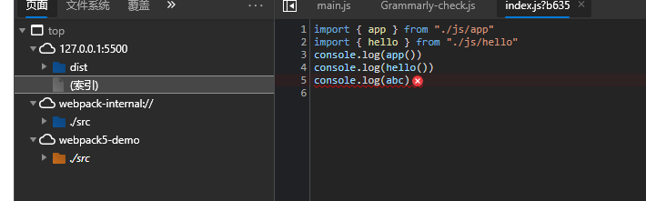


## inline-source-map

不会生成source map文件，而是为每个文件添加source map的DataURL，这个DataURL是包含一个文件完成source map信息的Base64编码，会导致文件很大

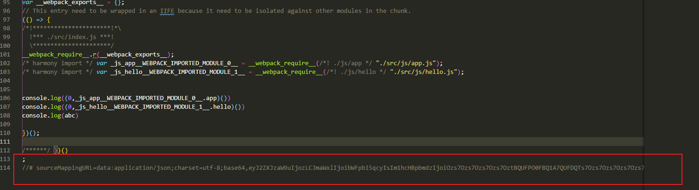

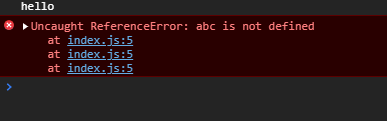


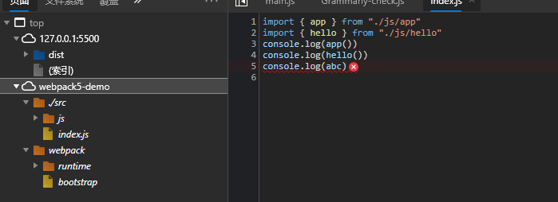


## cheap-source-map

会生成sourcemap，但是会更加高效一些（cheap低开销），因为它没有生成列映射（Column Mapping）

不包含列信息，不包含 loader 的 sourcemap，（譬如 babel 的 sourcemap）

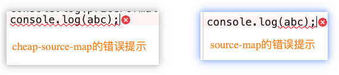


## cheap-module-source-map

不包含列信息，同时 loader 的 sourcemap 也被简化为只包含对应行的。最终的 sourcemap 只有一份，它是 webpack 对 loader 生成的 sourcemap 进行简化，然后再次生成的。

会生成sourcemap，类似于cheap-source-map，但是对源自loader的sourcemap处理会更好。

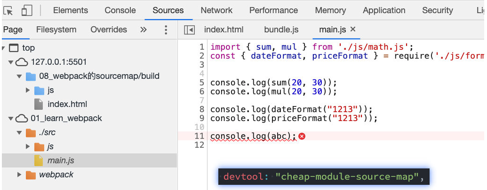

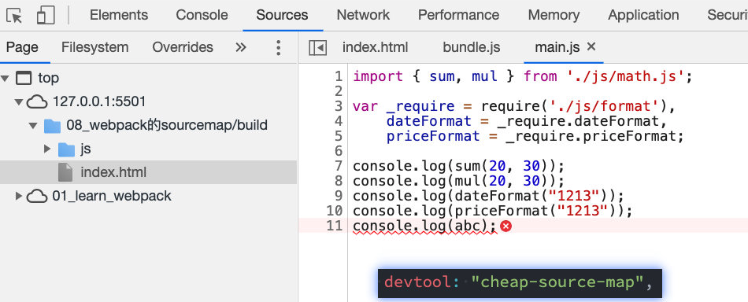


## hidden-source-map

- 会生成sourcemap，但是不会对source-map文件进行引用；

- 相当于删除了打包文件中对sourcemap的引用注释；


## nosources-source-map

会生成sourcemap，但是生成的sourcemap只有错误信息的提示，不会生成源代码文件；


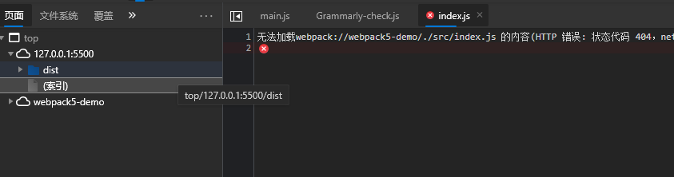


## 多个值的组合

- inline-|hidden-|eval：三个值时三选一；
-  nosources：可选值；

- cheap可选值，并且可以跟随module的值；

```js
[inline-|hidden-|eval-][nosources-][cheap-[module-]]source-map
```


