`./node_modules/.bin/webpack`

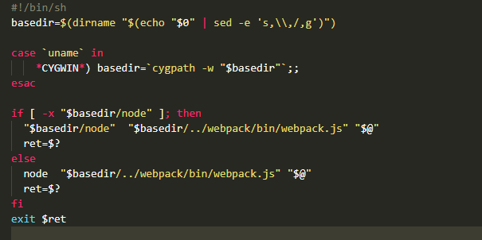

`./node_modules/webpack/bin/webpack.js`

```js
runCli(cli);
```

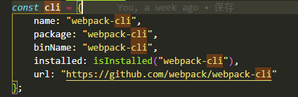

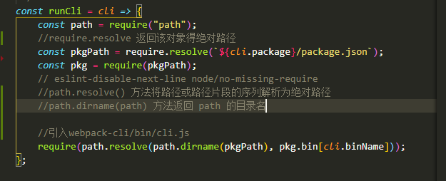

`webpack-cli/package.json`

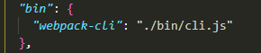

`bin/cli.js`

**执行`runCLi()`**

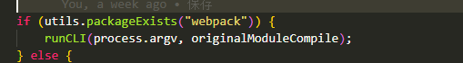

`webpack-cli/lib/bootstrap.js/runCLi`

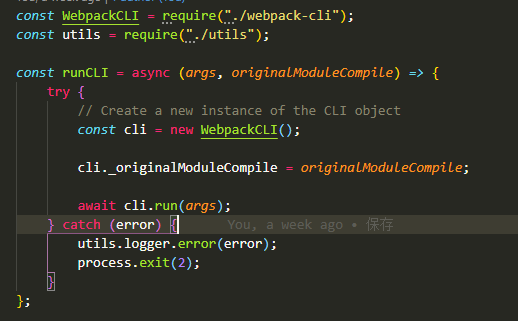

`webpack-cli/lib/webpack-cli.js/constructor()`

**调用`WebpackCLi`**

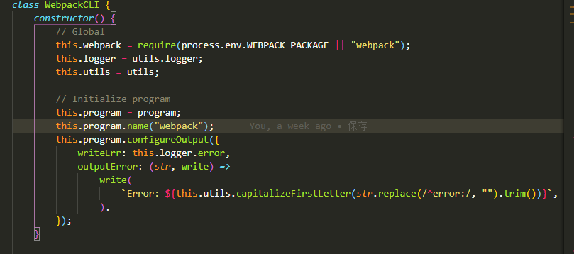

**引入`webpack`目的**

传入 webpack.config.js 等配置

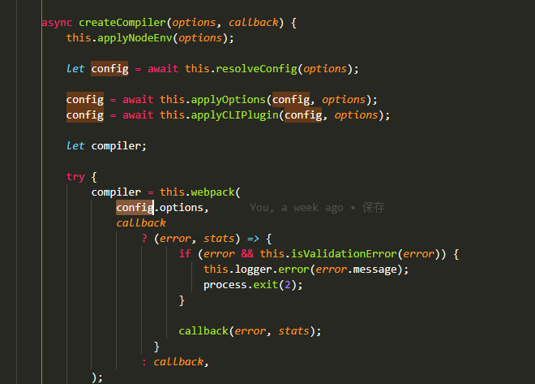

**执行 run 方法目的**

调用`this.makeCommand`

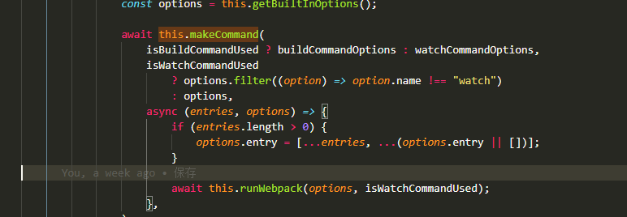

`makeCommand`内部执行`makeOption`方法

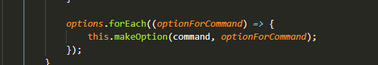

`makeCommand`在执行`runWebpack`方法

`runWebpack`执行`createCompiler`

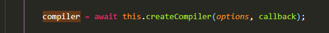

**`createCompiler`传入`webpack`配置生成 compiler**

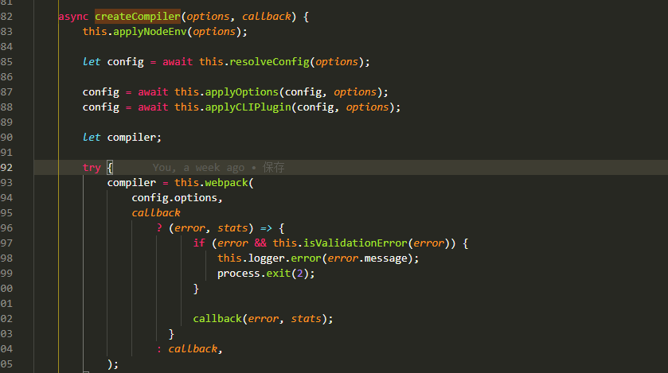

### 直接启动`webpack`

```js
const webpack = require("webpack");
const config = require("../webpack.config");
const compiler = webpack(config);
compiler.run((err, status) => {
  if (err) {
    console.error(err);
  } else {
    console.log(status);
  }
});
```

执行 node

## `webpack`源码

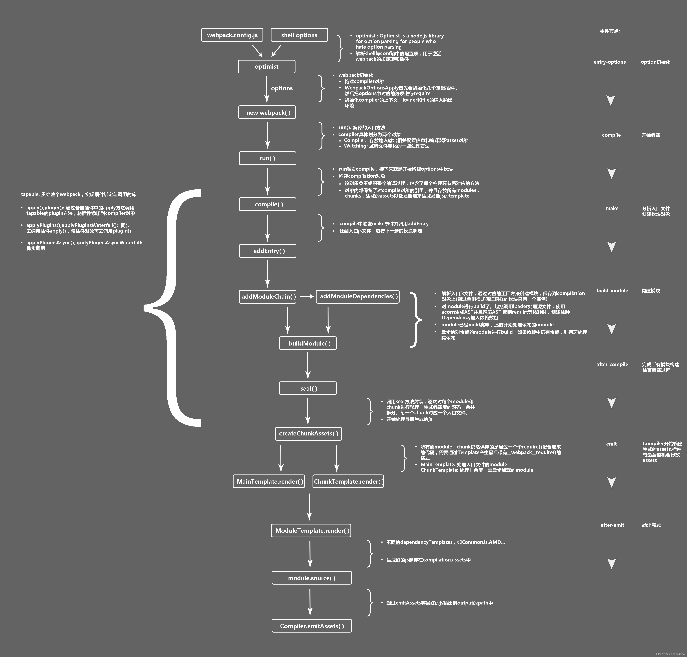
