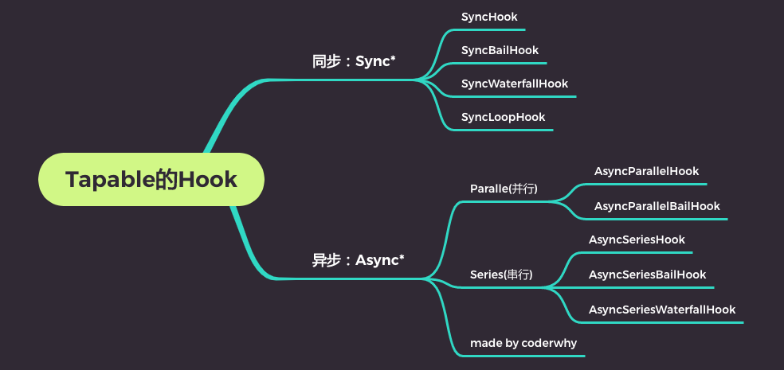
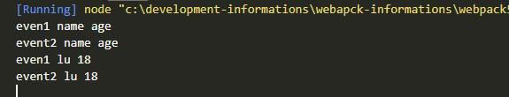
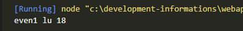
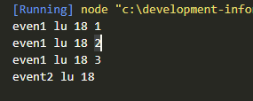
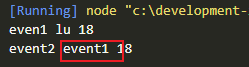
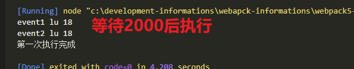
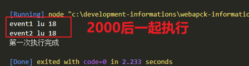

## Hook分类

同步和异步的：

- 以sync开头的，是同步的Hook；

- 以async开头的，两个事件处理回调，不会等待上一次处理回调结束后再执行下一次回调；


其他的类别:

- bail：当有返回值时，就不会执行后续的事件触发了；

- Loop：当返回值为true，就会反复执行该事件，当返回值为undefined或者不返回内容，就退出事件；

- Waterfall：当返回值不为undefined时，会将这次返回的结果作为下次事件的第一个参数；

- Parallel：并行，会同时执行次事件处理回调结束，才执行下一次事件处理回调；

- Series：串行，会等待上一是异步的Hook；




## SyncHook

```js
const { SyncHook } = require("tapable");

class LearnTable {
  constructor() {
    this.hooks = {
      syncHook: new SyncHook(["name", "age"]),
    };
    this.hooks.syncHook.tap("event1", (name, age) => {
      console.log("even1", name, age);
    });
    this.hooks.syncHook.tap("event2", (name, age) => {
      console.log("event2", name, age);
    });
  }
  emit() {
    this.hooks.syncHook.call("name", "age");
    this.hooks.syncHook.call("lu", 18);
  }
}
const lt = new LearnTable();
lt.emit();
```



## SyncBailHook

当有返回值时，就不会执行后续的事件触发了

```js
const { SyncHook, SyncBailHook } = require("tapable");

class LearnTable {
  constructor() {
    this.hooks = {,
      syncHook: new SyncBailHook(["name", "age"]),
    };
    this.hooks.syncHook.tap("event1", (name, age) => {
      console.log("even1", name, age);
      return "123";
    });
    this.hooks.syncHook.tap("event2", (name, age) => {
      console.log("event2", name, age);
    });
  }
  emit() {
    this.hooks.syncHook.call("lu", 18);
  }
}
const lt = new LearnTable();
lt.emit();
```



## SyncLoopHook

当返回值为true，就会反复执行该事件，当返回值为undefined或者不返回内容，就退出事件；

```js
const { SyncHook, SyncBailHook, SyncLoopHook } = require("tapable");
let counter = 0;
class LearnTable {
  constructor() {
    this.hooks = {
      syncHook: new SyncLoopHook(["name", "age"]),
    };
    this.hooks.syncHook.tap("event1", (name, age) => {
      if (counter++ < 3) {
        console.log("even1", name, age, counter);
        return true;
      }
    });
    this.hooks.syncHook.tap("event2", (name, age) => {
      console.log("event2", name, age);
    });
  }
  emit() {
    this.hooks.syncHook.call("lu", 18);
  }
}
const lt = new LearnTable();
lt.emit();

```



## SyncWaterfallHook

当返回值不为undefined时，会将这次返回的结果作为下次事件的第一个参数；

```js
const {
  SyncHook,
  SyncBailHook,
  SyncLoopHook,
  SyncWaterfallHook,
} = require("tapable");

class LearnTable {
  constructor() {
    this.hooks = {
      syncHook: new SyncWaterfallHook(["name", "age"]),
    };
    this.hooks.syncHook.tap("event1", (name, age) => {
      console.log("even1", name, age);
      return "event1";
    });
    this.hooks.syncHook.tap("event2", (name, age) => {
      console.log("event2", name, age);
    });
  }
  emit() {
    this.hooks.syncHook.call("lu", 18);
  }
}
const lt = new LearnTable();
lt.emit();

```



## AsyncSeriesHook

```js
const { AsyncSeriesHook } = require("tapable");
class LearnTable {
  constructor() {
    this.hooks = {
      asyncHook: new AsyncSeriesHook(["name", "age"]),
    };
    this.hooks.asyncHook.tapAsync("event1", (name, age, callback) => {
      setTimeout(() => {
        console.log("event1", name, age);
        callback();
      }, 2000);
    });
    this.hooks.asyncHook.tapAsync("event2", (name, age, callback) => {
      setTimeout(() => {
        console.log("event2", name, age);
        callback();
      }, 2000);
    });
  }
  emit() {
    this.hooks.asyncHook.callAsync("lu", 18, () => {
      console.log("第一次执行完成");
    });
  }
}
const lt = new LearnTable();
lt.emit();
```



## AsyncParallelHook

```js
const { AsyncSeriesHook, AsyncParallelHook } = require("tapable");
class LearnTable {
  constructor() {
    this.hooks = {
      asyncHook: new AsyncParallelHook(["name", "age"]),
    };
    this.hooks.asyncHook.tapAsync("event1", (name, age, callback) => {
      setTimeout(() => {
        console.log("event1", name, age);
        callback();
      }, 2000);
    });
    this.hooks.asyncHook.tapAsync("event2", (name, age, callback) => {
      setTimeout(() => {
        console.log("event2", name, age);
        callback();
      }, 2000);
    });
  }
  emit() {
    this.hooks.asyncHook.callAsync("lu", 18, () => {
      console.log("第一次执行完成");
    });
  }
}
const lt = new LearnTable();
lt.emit();

```



## topPromise

```js
const { AsyncSeriesHook, AsyncParallelHook } = require("tapable");
class LearnTable {
  constructor() {
    this.hooks = {
      asyncHook: new AsyncParallelHook(["name", "age"]),
    };
    this.hooks.asyncHook.tapPromise("event1", (name, age) => {
      return new Promise((resolve, reject) => {
        setTimeout(() => {
          console.log("event1", name, age);
          resolve();
        }, 2000);
      });
    });
    this.hooks.asyncHook.tapPromise("event2", (name, age) => {
      return new Promise((resolve, reject) => {
        setTimeout(() => {
          console.log("event1", name, age);
          resolve();
        }, 2000);
      });
    });
  }
  emit() {
    this.hooks.asyncHook.promise("lu", 18).then(() => {
      console.log("事件监听完成");
    });
  }
}
const lt = new LearnTable();
lt.emit();

```